# Project Analysis Report

**Project Path:** `C:\Users\wmmb\OneDrive\Desktop\SC Ai_leads_bot\SC_Ai_leads_bot`

## Architecture Overview

```mermaid
graph TB

    %% Styling
    classDef pythonModule fill:#3776ab,stroke:#333,stroke-width:2px,color:#fff
    classDef jsModule fill:#f7df1e,stroke:#333,stroke-width:2px,color:#000
    classDef database fill:#ff6b6b,stroke:#333,stroke-width:2px,color:#fff
    classDef route fill:#4ecdc4,stroke:#333,stroke-width:2px,color:#000

    %% Python Modules
    clear_db["clear_db.py+ clear_database()"]
    class clear_db pythonModule
    init_db["init_db.py+ init_database()"]
    class init_db pythonModule

    %% Database
    DB[("Database<br/>📊 lead_timeline<br/>📊 sqlite_sequence")]
    class DB database

    %% Module Dependencies

    %% Database Connections

```

## Database Schema

## Sequence Flow

## Module Details

### clear_db.py
- **Functions:** 1
  - clear_database
- **Classes:** 0
- **Imports:** 3

### init_db.py
- **Functions:** 1
  - init_database
- **Classes:** 0
- **Imports:** 6
