# SC LinkWizard - Project Architecture

*Auto-generated by generate_diagrams.py*

## ??️ System Architecture

```mermaid
graph TB
    subgraph "?? Frontend Templates"
        TMPL_0[dashboard_20251015105210.html]
        TMPL_1[dashboard_20251020114015.html]
        TMPL_2[dashboard_20251020114349.html]
        TMPL_3[dashboard_20251020114723.html]
        TMPL_4[dashboard_20251020114727.html]
        TMPL_5[dashboard_20251020114749.html]
        TMPL_6[leads_20251018084128.html]
        TMPL_7[leads_20251019120401.html]
        TMPL_8[leads_20251019120408.html]
        TMPL_9[leads_20251019120619.html]
        TMPL_10[leads_20251019120637.html]
        TMPL_11[leads_20251019120936.html]
        TMPL_12[leads_20251019140050.html]
        TMPL_13[leads_20251019140102.html]
        TMPL_14[messages_20251018084510.html]
        TMPL_15[messages_20251019132842.html]
        TMPL_16[messages_20251019132926.html]
        TMPL_17[messages_20251019132936.html]
        TMPL_18[messages_20251019132938.html]
        TMPL_19[messages_20251019132941.html]
        TMPL_20[messages_20251019133514.html]
        TMPL_21[messages_20251019142825.html]
        TMPL_22[messages_20251019142850.html]
        TMPL_23[messages_20251019143247.html]
        TMPL_24[messages_20251019143253.html]
        TMPL_25[messages_20251019143449.html]
        TMPL_26[analytics.html]
        TMPL_27[base.html]
        TMPL_28[dashboard.html]
        TMPL_29[index.html]
        TMPL_30[leads.html]
        TMPL_31[messages.html]
        TMPL_32[settings.html]
    end
    subgraph "⚡ JavaScript Files"
        JS_0[dashboard_20251014151530.js<br/>16 functions]
        JS_1[dashboard_20251020114123.js<br/>19 functions]
        JS_2[dashboard_20251020114846.js<br/>22 functions]
        JS_3[lead-timeline-ui_20251013121839.js<br/>0 functions]
        JS_4[lead-timeline-ui_20251019115832.js<br/>12 functions]
        JS_5[lead-timeline-ui_20251019140143.js<br/>8 functions]
        JS_6[lead-timeline-ui_20251019140146.js<br/>12 functions]
        JS_7[leads_20251018084118.js<br/>17 functions]
        JS_8[leads_20251019121036.js<br/>26 functions]
        JS_9[messages_20251018084518.js<br/>31 functions]
        JS_10[messages_20251019130153.js<br/>31 functions]
        JS_11[messages_20251019131021.js<br/>30 functions]
        JS_12[messages_20251019131025.js<br/>30 functions]
        JS_13[messages_20251019131111.js<br/>30 functions]
        JS_14[messages_20251019132049.js<br/>32 functions]
        JS_15[messages_20251019132405.js<br/>32 functions]
        JS_16[messages_20251019134306.js<br/>17 functions]
        JS_17[messages_20251019135114.js<br/>17 functions]
        JS_18[ab-winner-ui.js<br/>3 functions]
        JS_19[analytics.js<br/>11 functions]
        JS_20[dashboard.js<br/>37 functions]
        JS_21[lead-timeline-ui.js<br/>12 functions]
        JS_22[leads.js<br/>26 functions]
        JS_23[messages.js<br/>17 functions]
        JS_24[sales_nav.js<br/>4 functions]
        JS_25[schedule-ui.js<br/>6 functions]
        JS_26[schedule.js<br/>9 functions]
        JS_27[settings.js<br/>3 functions]
        JS_28[shared.js<br/>16 functions]
    end
    subgraph "?? Backend Python"
        PY_0[clear_db.py]
        PY_1[init_db.py]
        PY_2[project_analyzer.py]
        PY_3[app_20251018080108.py<br/>98 routes]
        PY_4[app_20251019114834.py<br/>98 routes]
        PY_5[app_20251019114900.py<br/>98 routes]
        PY_6[app_20251019114903.py<br/>98 routes]
        PY_7[app_20251019114905.py<br/>98 routes]
        PY_8[app_20251019114922.py<br/>98 routes]
        PY_9[app_20251019114925.py<br/>98 routes]
        PY_10[app_20251019114928.py<br/>98 routes]
        PY_11[app_20251019115313.py<br/>96 routes]
        PY_12[app_20251019115958.py<br/>96 routes]
        PY_13[app_20251019120001.py<br/>96 routes]
        PY_14[app_20251019120004.py<br/>96 routes]
        PY_15[app_20251019123802.py<br/>96 routes]
        PY_16[app_20251019123811.py<br/>96 routes]
        PY_17[app_20251019123843.py<br/>96 routes]
        PY_18[app_20251019123920.py<br/>94 routes]
        PY_19[app_20251019124316.py<br/>94 routes]
        PY_20[app_20251019124321.py<br/>94 routes]
        PY_21[app_20251019124342.py<br/>94 routes]
        PY_22[app_20251019124359.py<br/>92 routes]
        PY_23[app_20251019124408.py<br/>90 routes]
        PY_24[app_20251019124411.py<br/>92 routes]
        PY_25[app_20251019124415.py<br/>90 routes]
        PY_26[app_20251019124422.py<br/>88 routes]
        PY_27[app_20251019124424.py<br/>90 routes]
        PY_28[app_20251019124432.py<br/>88 routes]
        PY_29[app_20251019124441.py<br/>86 routes]
        PY_30[app_20251019124444.py<br/>86 routes]
        PY_31[app_20251019124450.py<br/>84 routes]
        PY_32[app_20251019124457.py<br/>82 routes]
        PY_33[app_20251019124502.py<br/>80 routes]
        PY_34[app_20251019124657.py<br/>76 routes]
        PY_35[app_20251019125422.py<br/>76 routes]
        PY_36[app_20251019125426.py<br/>78 routes]
        PY_37[app_20251019125428.py<br/>76 routes]
        PY_38[app_20251019125431.py<br/>78 routes]
        PY_39[app_20251019133246.py<br/>78 routes]
        PY_40[app_20251019133311.py<br/>76 routes]
        PY_41[app_20251019133314.py<br/>76 routes]
        PY_42[app_20251019133333.py<br/>74 routes]
        PY_43[app_20251019140936.py<br/>74 routes]
        PY_44[app_20251019141106.py<br/>74 routes]
        PY_45[app_20251020114617.py<br/>78 routes]
        PY_46[app_20251020115428.py<br/>78 routes]
        PY_47[app_20251020115441.py<br/>78 routes]
        PY_48[app_20251020115745.py<br/>78 routes]
        PY_49[lead_scorer_20251012190501.py]
        PY_50[lead_scorer_20251018215238.py]
        PY_51[lead_scorer_20251018215240.py]
        PY_52[lead_scorer_20251018215258.py]
        PY_53[lead_scorer_20251018215301.py]
        PY_54[lead_scorer_20251020120221.py]
        PY_55[lead_routes_20251019120748.py]
        PY_56[lead_routes_20251019120756.py<br/>11 routes]
        PY_57[lead_routes_20251019140122.py<br/>6 routes]
        PY_58[lead_routes_20251019140150.py<br/>11 routes]
        PY_59[message_routes_20251019123727.py]
        PY_60[message_routes_20251019123732.py]
        PY_61[message_routes_20251019125319.py]
        PY_62[message_routes_20251019130421.py]
        PY_63[message_routes_20251019130742.py]
        PY_64[message_routes_20251019131419.py]
        PY_65[message_routes_20251019132424.py]
        PY_66[message_routes_20251019132431.py]
        PY_67[message_routes_20251019133121.py]
        PY_68[schedule_routes_20251013040010.py<br/>10 routes]
        PY_69[schedule_routes_20251019114532.py<br/>10 routes]
        PY_70[template_routes_20251019123738.py]
        PY_71[template_routes_20251019123744.py]
        PY_72[template_routes_20251019125325.py]
        PY_73[timeline_routes_20251019115848.py]
        PY_74[timeline_routes_20251019115855.py<br/>6 routes]
        PY_75[optimal_time_ai_20251013025820.py]
        PY_76[optimal_time_ai_20251019114524.py]
        PY_77[db_manager_20251018075226.py]
        PY_78[db_manager_20251020114655.py]
        PY_79[db_manager_20251020114658.py]
        PY_80[linkedin_scraper_20251017103607.py]
        PY_81[linkedin_scraper_20251018215217.py]
        PY_82[app.py<br/>72 routes]
        PY_83[auth.py]
        PY_84[bot_controller.py]
        PY_85[config.py]
        PY_86[credentials_manager.py]
        PY_87[scraping_cooldown_manager.py]
        PY_88[session_manager.py]
        PY_89[__init__.py]
        PY_90[lead_scorer.py]
        PY_91[lead_timeline.py]
        PY_92[message_generator.py]
        PY_93[message_generator_abc.py]
        PY_94[persona_analyzer.py]
        PY_95[persona_parser.py]
        PY_96[__init__.py]
        PY_97[analytics_routes.py]
        PY_98[lead_routes.py<br/>11 routes]
        PY_99[message_routes.py]
        PY_100[missing_endpoints.py<br/>18 routes]
        PY_101[persona_routes.py<br/>8 routes]
        PY_102[schedule_routes.py<br/>10 routes]
        PY_103[template_routes.py]
        PY_104[timeline_routes.py<br/>6 routes]
        PY_105[__init__.py]
        PY_106[credentials_manager.py]
        PY_107[lead_selector.py]
        PY_108[linkedin_message_sender.py]
        PY_109[message_scheduler.py]
        PY_110[queue_processor.py]
        PY_111[scheduler.py]
        PY_112[__init__.py]
        PY_113[db_manager.py]
        PY_114[migration_enhanced_personas.py]
        PY_115[models.py]
        PY_116[__init__.py]
        PY_117[add_ab_tests_table.py]
        PY_118[add_message_schedule_table.py]
        PY_119[add_sales_nav_support.py]
        PY_120[add_scraping_cooldown.py]
        PY_121[linkedin_sender.py]
        PY_122[ai_enhanced_scraper.py]
        PY_123[linkedin_messenger.py]
        PY_124[linkedin_scraper.py]
        PY_125[test_pagination.py]
        PY_126[__init__.py]
        PY_127[optimal_time_ai.py]
        PY_128[__init__.py]
        PY_129[csv_handler.py]
        PY_130[encryption.py]
        PY_131[advanced_selector_finder.py]
        PY_132[batch_generate_messages.py]
        PY_133[check_credentials.py]
        PY_134[find_linkedin_selectors.py]
        PY_135[find_real_containers.py]
        PY_136[find_results.py]
        PY_137[init_db.py]
        PY_138[reset_database.py]
        PY_139[seed_data.py]
        PY_140[test_end_to_end.py]
        PY_141[test_full_workflow.py]
        PY_142[test_linkedin_scraper.py]
        PY_143[test_message_gen.py]
        PY_144[test_queue_processor.py]
        PY_145[test_scheduler.py]
        PY_146[__init__.py]
    end
    subgraph "?? Database"
        DB[(database.db)]
    end
    classDef frontend fill:#e1f5ff,stroke:#0288d1
    classDef javascript fill:#fff9c4,stroke:#f57c00
    classDef backend fill:#c8e6c9,stroke:#388e3c
    classDef database fill:#ffccbc,stroke:#d84315
```



## ?? API Endpoints

```mermaid
graph LR
    subgraph "app_20251018080108.py"
        R428[POST /]
        R886[POST /dashboard]
        R732[POST /leads]
        R749[POST /messages]
        R225[POST /analytics]
        R778[POST /settings]
        R280[POST /ab-analytics]
        R602[POST /api/auth/save-credentials]
        R775[POST /api/settings/save]
        R270[POST /api/settings/test]
        R976[POST /api/auth/test-connection]
        R280[POST /api/upload-targets]
        R671[POST /api/bot/start]
        R83[POST /api/bot/stop]
        R575[POST /api/bot/status]
        R969[POST /api/leads]
        R543[POST /api/leads/<int:lead_id>]
        R99[POST /api/personas]
        R453[POST /api/messages/generate]
        R733[POST /api/messages]
        R782[POST /api/messages/stats]
        R650[POST /api/leads/top]
        R688[POST /api/scrape/start]
        R408[POST /api/messages/<int:message_id>/approve]
        R53[POST /api/scheduler/status]
        R643[POST /api/scheduler/start]
        R60[POST /api/scheduler/stop]
        R418[POST /api/analytics/dashboard]
        R992[POST /api/messages/<int:message_id>/send]
        R369[POST /api/messages/schedule-batch]
        R109[POST /api/messages/<int:message_id>]
        R839[POST /api/activity-logs]
        R957[POST /api/ab-tests/<int:test_id>/analyze]
        R279[POST /api/ab-tests/auto-analyze]
        R782[POST /api/ab-tests/best-practices]
        R24[POST /api/ab-tests/winners]
        R307[POST /api/ab-tests/<int:test_id>/comparison]
        R219[POST /api/scraping/cooldown-status]
        R764[POST /api/scraping/update-limit]
        R444[POST /api/linkedin/login]
        R933[POST /api/linkedin/send-messages]
        R864[POST /api/linkedin/close]
        R434[POST /api/templates/save]
        R136[POST /api/templates]
        R506[POST /api/templates/<int:template_id>]
        R506[POST /api/templates/<int:template_id>]
        R331[POST /api/linkedin/status]
        R174[POST /api/messages/<int:message_id>/status]
        R280[POST /api/messages/<int:message_id>/edit]
        R428[POST /]
        R886[POST /dashboard]
        R732[POST /leads]
        R749[POST /messages]
        R225[POST /analytics]
        R778[POST /settings]
        R280[POST /ab-analytics]
        R602[POST /api/auth/save-credentials]
        R775[POST /api/settings/save]
        R270[POST /api/settings/test]
        R976[POST /api/auth/test-connection]
        R280[POST /api/upload-targets]
        R671[POST /api/bot/start]
        R83[POST /api/bot/stop]
        R575[POST /api/bot/status]
        R969[POST /api/leads]
        R543[POST /api/leads/<int:lead_id>]
        R99[POST /api/personas]
        R453[POST /api/messages/generate]
        R733[POST /api/messages]
        R782[POST /api/messages/stats]
        R650[POST /api/leads/top]
        R688[POST /api/scrape/start]
        R408[POST /api/messages/<int:message_id>/approve]
        R53[POST /api/scheduler/status]
        R643[POST /api/scheduler/start]
        R60[POST /api/scheduler/stop]
        R418[POST /api/analytics/dashboard]
        R992[POST /api/messages/<int:message_id>/send]
        R369[POST /api/messages/schedule-batch]
        R109[POST /api/messages/<int:message_id>]
        R839[POST /api/activity-logs]
        R957[POST /api/ab-tests/<int:test_id>/analyze]
        R279[POST /api/ab-tests/auto-analyze]
        R782[POST /api/ab-tests/best-practices]
        R24[POST /api/ab-tests/winners]
        R307[POST /api/ab-tests/<int:test_id>/comparison]
        R219[POST /api/scraping/cooldown-status]
        R764[POST /api/scraping/update-limit]
        R444[POST /api/linkedin/login]
        R933[POST /api/linkedin/send-messages]
        R864[POST /api/linkedin/close]
        R434[POST /api/templates/save]
        R136[POST /api/templates]
        R506[POST /api/templates/<int:template_id>]
        R506[POST /api/templates/<int:template_id>]
        R331[POST /api/linkedin/status]
        R174[POST /api/messages/<int:message_id>/status]
        R280[POST /api/messages/<int:message_id>/edit]
    end
    subgraph "app_20251019114834.py"
        R428[POST /]
        R886[POST /dashboard]
        R732[POST /leads]
        R749[POST /messages]
        R225[POST /analytics]
        R778[POST /settings]
        R280[POST /ab-analytics]
        R602[POST /api/auth/save-credentials]
        R775[POST /api/settings/save]
        R270[POST /api/settings/test]
        R976[POST /api/auth/test-connection]
        R280[POST /api/upload-targets]
        R671[POST /api/bot/start]
        R83[POST /api/bot/stop]
        R575[POST /api/bot/status]
        R969[POST /api/leads]
        R543[POST /api/leads/<int:lead_id>]
        R99[POST /api/personas]
        R453[POST /api/messages/generate]
        R733[POST /api/messages]
        R782[POST /api/messages/stats]
        R650[POST /api/leads/top]
        R688[POST /api/scrape/start]
        R408[POST /api/messages/<int:message_id>/approve]
        R53[POST /api/scheduler/status]
        R643[POST /api/scheduler/start]
        R60[POST /api/scheduler/stop]
        R418[POST /api/analytics/dashboard]
        R992[POST /api/messages/<int:message_id>/send]
        R369[POST /api/messages/schedule-batch]
        R109[POST /api/messages/<int:message_id>]
        R839[POST /api/activity-logs]
        R957[POST /api/ab-tests/<int:test_id>/analyze]
        R279[POST /api/ab-tests/auto-analyze]
        R782[POST /api/ab-tests/best-practices]
        R24[POST /api/ab-tests/winners]
        R307[POST /api/ab-tests/<int:test_id>/comparison]
        R219[POST /api/scraping/cooldown-status]
        R764[POST /api/scraping/update-limit]
        R444[POST /api/linkedin/login]
        R933[POST /api/linkedin/send-messages]
        R864[POST /api/linkedin/close]
        R434[POST /api/templates/save]
        R136[POST /api/templates]
        R506[POST /api/templates/<int:template_id>]
        R506[POST /api/templates/<int:template_id>]
        R331[POST /api/linkedin/status]
        R174[POST /api/messages/<int:message_id>/status]
        R280[POST /api/messages/<int:message_id>/edit]
        R428[POST /]
        R886[POST /dashboard]
        R732[POST /leads]
        R749[POST /messages]
        R225[POST /analytics]
        R778[POST /settings]
        R280[POST /ab-analytics]
        R602[POST /api/auth/save-credentials]
        R775[POST /api/settings/save]
        R270[POST /api/settings/test]
        R976[POST /api/auth/test-connection]
        R280[POST /api/upload-targets]
        R671[POST /api/bot/start]
        R83[POST /api/bot/stop]
        R575[POST /api/bot/status]
        R969[POST /api/leads]
        R543[POST /api/leads/<int:lead_id>]
        R99[POST /api/personas]
        R453[POST /api/messages/generate]
        R733[POST /api/messages]
        R782[POST /api/messages/stats]
        R650[POST /api/leads/top]
        R688[POST /api/scrape/start]
        R408[POST /api/messages/<int:message_id>/approve]
        R53[POST /api/scheduler/status]
        R643[POST /api/scheduler/start]
        R60[POST /api/scheduler/stop]
        R418[POST /api/analytics/dashboard]
        R992[POST /api/messages/<int:message_id>/send]
        R369[POST /api/messages/schedule-batch]
        R109[POST /api/messages/<int:message_id>]
        R839[POST /api/activity-logs]
        R957[POST /api/ab-tests/<int:test_id>/analyze]
        R279[POST /api/ab-tests/auto-analyze]
        R782[POST /api/ab-tests/best-practices]
        R24[POST /api/ab-tests/winners]
        R307[POST /api/ab-tests/<int:test_id>/comparison]
        R219[POST /api/scraping/cooldown-status]
        R764[POST /api/scraping/update-limit]
        R444[POST /api/linkedin/login]
        R933[POST /api/linkedin/send-messages]
        R864[POST /api/linkedin/close]
        R434[POST /api/templates/save]
        R136[POST /api/templates]
        R506[POST /api/templates/<int:template_id>]
        R506[POST /api/templates/<int:template_id>]
        R331[POST /api/linkedin/status]
        R174[POST /api/messages/<int:message_id>/status]
        R280[POST /api/messages/<int:message_id>/edit]
    end
    subgraph "app_20251019114900.py"
        R428[POST /]
        R886[POST /dashboard]
        R732[POST /leads]
        R749[POST /messages]
        R225[POST /analytics]
        R778[POST /settings]
        R280[POST /ab-analytics]
        R602[POST /api/auth/save-credentials]
        R775[POST /api/settings/save]
        R270[POST /api/settings/test]
        R976[POST /api/auth/test-connection]
        R280[POST /api/upload-targets]
        R671[POST /api/bot/start]
        R83[POST /api/bot/stop]
        R575[POST /api/bot/status]
        R969[POST /api/leads]
        R543[POST /api/leads/<int:lead_id>]
        R99[POST /api/personas]
        R453[POST /api/messages/generate]
        R733[POST /api/messages]
        R782[POST /api/messages/stats]
        R650[POST /api/leads/top]
        R688[POST /api/scrape/start]
        R408[POST /api/messages/<int:message_id>/approve]
        R53[POST /api/scheduler/status]
        R643[POST /api/scheduler/start]
        R60[POST /api/scheduler/stop]
        R418[POST /api/analytics/dashboard]
        R992[POST /api/messages/<int:message_id>/send]
        R369[POST /api/messages/schedule-batch]
        R109[POST /api/messages/<int:message_id>]
        R839[POST /api/activity-logs]
        R957[POST /api/ab-tests/<int:test_id>/analyze]
        R279[POST /api/ab-tests/auto-analyze]
        R782[POST /api/ab-tests/best-practices]
        R24[POST /api/ab-tests/winners]
        R307[POST /api/ab-tests/<int:test_id>/comparison]
        R219[POST /api/scraping/cooldown-status]
        R764[POST /api/scraping/update-limit]
        R444[POST /api/linkedin/login]
        R933[POST /api/linkedin/send-messages]
        R864[POST /api/linkedin/close]
        R434[POST /api/templates/save]
        R136[POST /api/templates]
        R506[POST /api/templates/<int:template_id>]
        R506[POST /api/templates/<int:template_id>]
        R331[POST /api/linkedin/status]
        R174[POST /api/messages/<int:message_id>/status]
        R280[POST /api/messages/<int:message_id>/edit]
        R428[POST /]
        R886[POST /dashboard]
        R732[POST /leads]
        R749[POST /messages]
        R225[POST /analytics]
        R778[POST /settings]
        R280[POST /ab-analytics]
        R602[POST /api/auth/save-credentials]
        R775[POST /api/settings/save]
        R270[POST /api/settings/test]
        R976[POST /api/auth/test-connection]
        R280[POST /api/upload-targets]
        R671[POST /api/bot/start]
        R83[POST /api/bot/stop]
        R575[POST /api/bot/status]
        R969[POST /api/leads]
        R543[POST /api/leads/<int:lead_id>]
        R99[POST /api/personas]
        R453[POST /api/messages/generate]
        R733[POST /api/messages]
        R782[POST /api/messages/stats]
        R650[POST /api/leads/top]
        R688[POST /api/scrape/start]
        R408[POST /api/messages/<int:message_id>/approve]
        R53[POST /api/scheduler/status]
        R643[POST /api/scheduler/start]
        R60[POST /api/scheduler/stop]
        R418[POST /api/analytics/dashboard]
        R992[POST /api/messages/<int:message_id>/send]
        R369[POST /api/messages/schedule-batch]
        R109[POST /api/messages/<int:message_id>]
        R839[POST /api/activity-logs]
        R957[POST /api/ab-tests/<int:test_id>/analyze]
        R279[POST /api/ab-tests/auto-analyze]
        R782[POST /api/ab-tests/best-practices]
        R24[POST /api/ab-tests/winners]
        R307[POST /api/ab-tests/<int:test_id>/comparison]
        R219[POST /api/scraping/cooldown-status]
        R764[POST /api/scraping/update-limit]
        R444[POST /api/linkedin/login]
        R933[POST /api/linkedin/send-messages]
        R864[POST /api/linkedin/close]
        R434[POST /api/templates/save]
        R136[POST /api/templates]
        R506[POST /api/templates/<int:template_id>]
        R506[POST /api/templates/<int:template_id>]
        R331[POST /api/linkedin/status]
        R174[POST /api/messages/<int:message_id>/status]
        R280[POST /api/messages/<int:message_id>/edit]
    end
    subgraph "app_20251019114903.py"
        R428[POST /]
        R886[POST /dashboard]
        R732[POST /leads]
        R749[POST /messages]
        R225[POST /analytics]
        R778[POST /settings]
        R280[POST /ab-analytics]
        R602[POST /api/auth/save-credentials]
        R775[POST /api/settings/save]
        R270[POST /api/settings/test]
        R976[POST /api/auth/test-connection]
        R280[POST /api/upload-targets]
        R671[POST /api/bot/start]
        R83[POST /api/bot/stop]
        R575[POST /api/bot/status]
        R969[POST /api/leads]
        R543[POST /api/leads/<int:lead_id>]
        R99[POST /api/personas]
        R453[POST /api/messages/generate]
        R733[POST /api/messages]
        R782[POST /api/messages/stats]
        R650[POST /api/leads/top]
        R688[POST /api/scrape/start]
        R408[POST /api/messages/<int:message_id>/approve]
        R53[POST /api/scheduler/status]
        R643[POST /api/scheduler/start]
        R60[POST /api/scheduler/stop]
        R418[POST /api/analytics/dashboard]
        R992[POST /api/messages/<int:message_id>/send]
        R369[POST /api/messages/schedule-batch]
        R109[POST /api/messages/<int:message_id>]
        R839[POST /api/activity-logs]
        R957[POST /api/ab-tests/<int:test_id>/analyze]
        R279[POST /api/ab-tests/auto-analyze]
        R782[POST /api/ab-tests/best-practices]
        R24[POST /api/ab-tests/winners]
        R307[POST /api/ab-tests/<int:test_id>/comparison]
        R219[POST /api/scraping/cooldown-status]
        R764[POST /api/scraping/update-limit]
        R444[POST /api/linkedin/login]
        R933[POST /api/linkedin/send-messages]
        R864[POST /api/linkedin/close]
        R434[POST /api/templates/save]
        R136[POST /api/templates]
        R506[POST /api/templates/<int:template_id>]
        R506[POST /api/templates/<int:template_id>]
        R331[POST /api/linkedin/status]
        R174[POST /api/messages/<int:message_id>/status]
        R280[POST /api/messages/<int:message_id>/edit]
        R428[POST /]
        R886[POST /dashboard]
        R732[POST /leads]
        R749[POST /messages]
        R225[POST /analytics]
        R778[POST /settings]
        R280[POST /ab-analytics]
        R602[POST /api/auth/save-credentials]
        R775[POST /api/settings/save]
        R270[POST /api/settings/test]
        R976[POST /api/auth/test-connection]
        R280[POST /api/upload-targets]
        R671[POST /api/bot/start]
        R83[POST /api/bot/stop]
        R575[POST /api/bot/status]
        R969[POST /api/leads]
        R543[POST /api/leads/<int:lead_id>]
        R99[POST /api/personas]
        R453[POST /api/messages/generate]
        R733[POST /api/messages]
        R782[POST /api/messages/stats]
        R650[POST /api/leads/top]
        R688[POST /api/scrape/start]
        R408[POST /api/messages/<int:message_id>/approve]
        R53[POST /api/scheduler/status]
        R643[POST /api/scheduler/start]
        R60[POST /api/scheduler/stop]
        R418[POST /api/analytics/dashboard]
        R992[POST /api/messages/<int:message_id>/send]
        R369[POST /api/messages/schedule-batch]
        R109[POST /api/messages/<int:message_id>]
        R839[POST /api/activity-logs]
        R957[POST /api/ab-tests/<int:test_id>/analyze]
        R279[POST /api/ab-tests/auto-analyze]
        R782[POST /api/ab-tests/best-practices]
        R24[POST /api/ab-tests/winners]
        R307[POST /api/ab-tests/<int:test_id>/comparison]
        R219[POST /api/scraping/cooldown-status]
        R764[POST /api/scraping/update-limit]
        R444[POST /api/linkedin/login]
        R933[POST /api/linkedin/send-messages]
        R864[POST /api/linkedin/close]
        R434[POST /api/templates/save]
        R136[POST /api/templates]
        R506[POST /api/templates/<int:template_id>]
        R506[POST /api/templates/<int:template_id>]
        R331[POST /api/linkedin/status]
        R174[POST /api/messages/<int:message_id>/status]
        R280[POST /api/messages/<int:message_id>/edit]
    end
    subgraph "app_20251019114905.py"
        R428[POST /]
        R886[POST /dashboard]
        R732[POST /leads]
        R749[POST /messages]
        R225[POST /analytics]
        R778[POST /settings]
        R280[POST /ab-analytics]
        R602[POST /api/auth/save-credentials]
        R775[POST /api/settings/save]
        R270[POST /api/settings/test]
        R976[POST /api/auth/test-connection]
        R280[POST /api/upload-targets]
        R671[POST /api/bot/start]
        R83[POST /api/bot/stop]
        R575[POST /api/bot/status]
        R969[POST /api/leads]
        R543[POST /api/leads/<int:lead_id>]
        R99[POST /api/personas]
        R453[POST /api/messages/generate]
        R733[POST /api/messages]
        R782[POST /api/messages/stats]
        R650[POST /api/leads/top]
        R688[POST /api/scrape/start]
        R408[POST /api/messages/<int:message_id>/approve]
        R53[POST /api/scheduler/status]
        R643[POST /api/scheduler/start]
        R60[POST /api/scheduler/stop]
        R418[POST /api/analytics/dashboard]
        R992[POST /api/messages/<int:message_id>/send]
        R369[POST /api/messages/schedule-batch]
        R109[POST /api/messages/<int:message_id>]
        R839[POST /api/activity-logs]
        R957[POST /api/ab-tests/<int:test_id>/analyze]
        R279[POST /api/ab-tests/auto-analyze]
        R782[POST /api/ab-tests/best-practices]
        R24[POST /api/ab-tests/winners]
        R307[POST /api/ab-tests/<int:test_id>/comparison]
        R219[POST /api/scraping/cooldown-status]
        R764[POST /api/scraping/update-limit]
        R444[POST /api/linkedin/login]
        R933[POST /api/linkedin/send-messages]
        R864[POST /api/linkedin/close]
        R434[POST /api/templates/save]
        R136[POST /api/templates]
        R506[POST /api/templates/<int:template_id>]
        R506[POST /api/templates/<int:template_id>]
        R331[POST /api/linkedin/status]
        R174[POST /api/messages/<int:message_id>/status]
        R280[POST /api/messages/<int:message_id>/edit]
        R428[POST /]
        R886[POST /dashboard]
        R732[POST /leads]
        R749[POST /messages]
        R225[POST /analytics]
        R778[POST /settings]
        R280[POST /ab-analytics]
        R602[POST /api/auth/save-credentials]
        R775[POST /api/settings/save]
        R270[POST /api/settings/test]
        R976[POST /api/auth/test-connection]
        R280[POST /api/upload-targets]
        R671[POST /api/bot/start]
        R83[POST /api/bot/stop]
        R575[POST /api/bot/status]
        R969[POST /api/leads]
        R543[POST /api/leads/<int:lead_id>]
        R99[POST /api/personas]
        R453[POST /api/messages/generate]
        R733[POST /api/messages]
        R782[POST /api/messages/stats]
        R650[POST /api/leads/top]
        R688[POST /api/scrape/start]
        R408[POST /api/messages/<int:message_id>/approve]
        R53[POST /api/scheduler/status]
        R643[POST /api/scheduler/start]
        R60[POST /api/scheduler/stop]
        R418[POST /api/analytics/dashboard]
        R992[POST /api/messages/<int:message_id>/send]
        R369[POST /api/messages/schedule-batch]
        R109[POST /api/messages/<int:message_id>]
        R839[POST /api/activity-logs]
        R957[POST /api/ab-tests/<int:test_id>/analyze]
        R279[POST /api/ab-tests/auto-analyze]
        R782[POST /api/ab-tests/best-practices]
        R24[POST /api/ab-tests/winners]
        R307[POST /api/ab-tests/<int:test_id>/comparison]
        R219[POST /api/scraping/cooldown-status]
        R764[POST /api/scraping/update-limit]
        R444[POST /api/linkedin/login]
        R933[POST /api/linkedin/send-messages]
        R864[POST /api/linkedin/close]
        R434[POST /api/templates/save]
        R136[POST /api/templates]
        R506[POST /api/templates/<int:template_id>]
        R506[POST /api/templates/<int:template_id>]
        R331[POST /api/linkedin/status]
        R174[POST /api/messages/<int:message_id>/status]
        R280[POST /api/messages/<int:message_id>/edit]
    end
    subgraph "app_20251019114922.py"
        R428[POST /]
        R886[POST /dashboard]
        R732[POST /leads]
        R749[POST /messages]
        R225[POST /analytics]
        R778[POST /settings]
        R280[POST /ab-analytics]
        R602[POST /api/auth/save-credentials]
        R775[POST /api/settings/save]
        R270[POST /api/settings/test]
        R976[POST /api/auth/test-connection]
        R280[POST /api/upload-targets]
        R671[POST /api/bot/start]
        R83[POST /api/bot/stop]
        R575[POST /api/bot/status]
        R969[POST /api/leads]
        R543[POST /api/leads/<int:lead_id>]
        R99[POST /api/personas]
        R453[POST /api/messages/generate]
        R733[POST /api/messages]
        R782[POST /api/messages/stats]
        R650[POST /api/leads/top]
        R688[POST /api/scrape/start]
        R408[POST /api/messages/<int:message_id>/approve]
        R53[POST /api/scheduler/status]
        R643[POST /api/scheduler/start]
        R60[POST /api/scheduler/stop]
        R418[POST /api/analytics/dashboard]
        R992[POST /api/messages/<int:message_id>/send]
        R369[POST /api/messages/schedule-batch]
        R109[POST /api/messages/<int:message_id>]
        R839[POST /api/activity-logs]
        R957[POST /api/ab-tests/<int:test_id>/analyze]
        R279[POST /api/ab-tests/auto-analyze]
        R782[POST /api/ab-tests/best-practices]
        R24[POST /api/ab-tests/winners]
        R307[POST /api/ab-tests/<int:test_id>/comparison]
        R219[POST /api/scraping/cooldown-status]
        R764[POST /api/scraping/update-limit]
        R444[POST /api/linkedin/login]
        R933[POST /api/linkedin/send-messages]
        R864[POST /api/linkedin/close]
        R434[POST /api/templates/save]
        R136[POST /api/templates]
        R506[POST /api/templates/<int:template_id>]
        R506[POST /api/templates/<int:template_id>]
        R331[POST /api/linkedin/status]
        R174[POST /api/messages/<int:message_id>/status]
        R280[POST /api/messages/<int:message_id>/edit]
        R428[POST /]
        R886[POST /dashboard]
        R732[POST /leads]
        R749[POST /messages]
        R225[POST /analytics]
        R778[POST /settings]
        R280[POST /ab-analytics]
        R602[POST /api/auth/save-credentials]
        R775[POST /api/settings/save]
        R270[POST /api/settings/test]
        R976[POST /api/auth/test-connection]
        R280[POST /api/upload-targets]
        R671[POST /api/bot/start]
        R83[POST /api/bot/stop]
        R575[POST /api/bot/status]
        R969[POST /api/leads]
        R543[POST /api/leads/<int:lead_id>]
        R99[POST /api/personas]
        R453[POST /api/messages/generate]
        R733[POST /api/messages]
        R782[POST /api/messages/stats]
        R650[POST /api/leads/top]
        R688[POST /api/scrape/start]
        R408[POST /api/messages/<int:message_id>/approve]
        R53[POST /api/scheduler/status]
        R643[POST /api/scheduler/start]
        R60[POST /api/scheduler/stop]
        R418[POST /api/analytics/dashboard]
        R992[POST /api/messages/<int:message_id>/send]
        R369[POST /api/messages/schedule-batch]
        R109[POST /api/messages/<int:message_id>]
        R839[POST /api/activity-logs]
        R957[POST /api/ab-tests/<int:test_id>/analyze]
        R279[POST /api/ab-tests/auto-analyze]
        R782[POST /api/ab-tests/best-practices]
        R24[POST /api/ab-tests/winners]
        R307[POST /api/ab-tests/<int:test_id>/comparison]
        R219[POST /api/scraping/cooldown-status]
        R764[POST /api/scraping/update-limit]
        R444[POST /api/linkedin/login]
        R933[POST /api/linkedin/send-messages]
        R864[POST /api/linkedin/close]
        R434[POST /api/templates/save]
        R136[POST /api/templates]
        R506[POST /api/templates/<int:template_id>]
        R506[POST /api/templates/<int:template_id>]
        R331[POST /api/linkedin/status]
        R174[POST /api/messages/<int:message_id>/status]
        R280[POST /api/messages/<int:message_id>/edit]
    end
    subgraph "app_20251019114925.py"
        R428[POST /]
        R886[POST /dashboard]
        R732[POST /leads]
        R749[POST /messages]
        R225[POST /analytics]
        R778[POST /settings]
        R280[POST /ab-analytics]
        R602[POST /api/auth/save-credentials]
        R775[POST /api/settings/save]
        R270[POST /api/settings/test]
        R976[POST /api/auth/test-connection]
        R280[POST /api/upload-targets]
        R671[POST /api/bot/start]
        R83[POST /api/bot/stop]
        R575[POST /api/bot/status]
        R969[POST /api/leads]
        R543[POST /api/leads/<int:lead_id>]
        R99[POST /api/personas]
        R453[POST /api/messages/generate]
        R733[POST /api/messages]
        R782[POST /api/messages/stats]
        R650[POST /api/leads/top]
        R688[POST /api/scrape/start]
        R408[POST /api/messages/<int:message_id>/approve]
        R53[POST /api/scheduler/status]
        R643[POST /api/scheduler/start]
        R60[POST /api/scheduler/stop]
        R418[POST /api/analytics/dashboard]
        R992[POST /api/messages/<int:message_id>/send]
        R369[POST /api/messages/schedule-batch]
        R109[POST /api/messages/<int:message_id>]
        R839[POST /api/activity-logs]
        R957[POST /api/ab-tests/<int:test_id>/analyze]
        R279[POST /api/ab-tests/auto-analyze]
        R782[POST /api/ab-tests/best-practices]
        R24[POST /api/ab-tests/winners]
        R307[POST /api/ab-tests/<int:test_id>/comparison]
        R219[POST /api/scraping/cooldown-status]
        R764[POST /api/scraping/update-limit]
        R444[POST /api/linkedin/login]
        R933[POST /api/linkedin/send-messages]
        R864[POST /api/linkedin/close]
        R434[POST /api/templates/save]
        R136[POST /api/templates]
        R506[POST /api/templates/<int:template_id>]
        R506[POST /api/templates/<int:template_id>]
        R331[POST /api/linkedin/status]
        R174[POST /api/messages/<int:message_id>/status]
        R280[POST /api/messages/<int:message_id>/edit]
        R428[POST /]
        R886[POST /dashboard]
        R732[POST /leads]
        R749[POST /messages]
        R225[POST /analytics]
        R778[POST /settings]
        R280[POST /ab-analytics]
        R602[POST /api/auth/save-credentials]
        R775[POST /api/settings/save]
        R270[POST /api/settings/test]
        R976[POST /api/auth/test-connection]
        R280[POST /api/upload-targets]
        R671[POST /api/bot/start]
        R83[POST /api/bot/stop]
        R575[POST /api/bot/status]
        R969[POST /api/leads]
        R543[POST /api/leads/<int:lead_id>]
        R99[POST /api/personas]
        R453[POST /api/messages/generate]
        R733[POST /api/messages]
        R782[POST /api/messages/stats]
        R650[POST /api/leads/top]
        R688[POST /api/scrape/start]
        R408[POST /api/messages/<int:message_id>/approve]
        R53[POST /api/scheduler/status]
        R643[POST /api/scheduler/start]
        R60[POST /api/scheduler/stop]
        R418[POST /api/analytics/dashboard]
        R992[POST /api/messages/<int:message_id>/send]
        R369[POST /api/messages/schedule-batch]
        R109[POST /api/messages/<int:message_id>]
        R839[POST /api/activity-logs]
        R957[POST /api/ab-tests/<int:test_id>/analyze]
        R279[POST /api/ab-tests/auto-analyze]
        R782[POST /api/ab-tests/best-practices]
        R24[POST /api/ab-tests/winners]
        R307[POST /api/ab-tests/<int:test_id>/comparison]
        R219[POST /api/scraping/cooldown-status]
        R764[POST /api/scraping/update-limit]
        R444[POST /api/linkedin/login]
        R933[POST /api/linkedin/send-messages]
        R864[POST /api/linkedin/close]
        R434[POST /api/templates/save]
        R136[POST /api/templates]
        R506[POST /api/templates/<int:template_id>]
        R506[POST /api/templates/<int:template_id>]
        R331[POST /api/linkedin/status]
        R174[POST /api/messages/<int:message_id>/status]
        R280[POST /api/messages/<int:message_id>/edit]
    end
    subgraph "app_20251019114928.py"
        R428[POST /]
        R886[POST /dashboard]
        R732[POST /leads]
        R749[POST /messages]
        R225[POST /analytics]
        R778[POST /settings]
        R280[POST /ab-analytics]
        R602[POST /api/auth/save-credentials]
        R775[POST /api/settings/save]
        R270[POST /api/settings/test]
        R976[POST /api/auth/test-connection]
        R280[POST /api/upload-targets]
        R671[POST /api/bot/start]
        R83[POST /api/bot/stop]
        R575[POST /api/bot/status]
        R969[POST /api/leads]
        R543[POST /api/leads/<int:lead_id>]
        R99[POST /api/personas]
        R453[POST /api/messages/generate]
        R733[POST /api/messages]
        R782[POST /api/messages/stats]
        R650[POST /api/leads/top]
        R688[POST /api/scrape/start]
        R408[POST /api/messages/<int:message_id>/approve]
        R53[POST /api/scheduler/status]
        R643[POST /api/scheduler/start]
        R60[POST /api/scheduler/stop]
        R418[POST /api/analytics/dashboard]
        R992[POST /api/messages/<int:message_id>/send]
        R369[POST /api/messages/schedule-batch]
        R109[POST /api/messages/<int:message_id>]
        R839[POST /api/activity-logs]
        R957[POST /api/ab-tests/<int:test_id>/analyze]
        R279[POST /api/ab-tests/auto-analyze]
        R782[POST /api/ab-tests/best-practices]
        R24[POST /api/ab-tests/winners]
        R307[POST /api/ab-tests/<int:test_id>/comparison]
        R219[POST /api/scraping/cooldown-status]
        R764[POST /api/scraping/update-limit]
        R444[POST /api/linkedin/login]
        R933[POST /api/linkedin/send-messages]
        R864[POST /api/linkedin/close]
        R434[POST /api/templates/save]
        R136[POST /api/templates]
        R506[POST /api/templates/<int:template_id>]
        R506[POST /api/templates/<int:template_id>]
        R331[POST /api/linkedin/status]
        R174[POST /api/messages/<int:message_id>/status]
        R280[POST /api/messages/<int:message_id>/edit]
        R428[POST /]
        R886[POST /dashboard]
        R732[POST /leads]
        R749[POST /messages]
        R225[POST /analytics]
        R778[POST /settings]
        R280[POST /ab-analytics]
        R602[POST /api/auth/save-credentials]
        R775[POST /api/settings/save]
        R270[POST /api/settings/test]
        R976[POST /api/auth/test-connection]
        R280[POST /api/upload-targets]
        R671[POST /api/bot/start]
        R83[POST /api/bot/stop]
        R575[POST /api/bot/status]
        R969[POST /api/leads]
        R543[POST /api/leads/<int:lead_id>]
        R99[POST /api/personas]
        R453[POST /api/messages/generate]
        R733[POST /api/messages]
        R782[POST /api/messages/stats]
        R650[POST /api/leads/top]
        R688[POST /api/scrape/start]
        R408[POST /api/messages/<int:message_id>/approve]
        R53[POST /api/scheduler/status]
        R643[POST /api/scheduler/start]
        R60[POST /api/scheduler/stop]
        R418[POST /api/analytics/dashboard]
        R992[POST /api/messages/<int:message_id>/send]
        R369[POST /api/messages/schedule-batch]
        R109[POST /api/messages/<int:message_id>]
        R839[POST /api/activity-logs]
        R957[POST /api/ab-tests/<int:test_id>/analyze]
        R279[POST /api/ab-tests/auto-analyze]
        R782[POST /api/ab-tests/best-practices]
        R24[POST /api/ab-tests/winners]
        R307[POST /api/ab-tests/<int:test_id>/comparison]
        R219[POST /api/scraping/cooldown-status]
        R764[POST /api/scraping/update-limit]
        R444[POST /api/linkedin/login]
        R933[POST /api/linkedin/send-messages]
        R864[POST /api/linkedin/close]
        R434[POST /api/templates/save]
        R136[POST /api/templates]
        R506[POST /api/templates/<int:template_id>]
        R506[POST /api/templates/<int:template_id>]
        R331[POST /api/linkedin/status]
        R174[POST /api/messages/<int:message_id>/status]
        R280[POST /api/messages/<int:message_id>/edit]
    end
    subgraph "app_20251019115313.py"
        R428[POST /]
        R886[POST /dashboard]
        R732[POST /leads]
        R749[POST /messages]
        R225[POST /analytics]
        R778[POST /settings]
        R280[POST /ab-analytics]
        R602[POST /api/auth/save-credentials]
        R775[POST /api/settings/save]
        R270[POST /api/settings/test]
        R976[POST /api/auth/test-connection]
        R280[POST /api/upload-targets]
        R671[POST /api/bot/start]
        R83[POST /api/bot/stop]
        R575[POST /api/bot/status]
        R969[POST /api/leads]
        R543[POST /api/leads/<int:lead_id>]
        R99[POST /api/personas]
        R453[POST /api/messages/generate]
        R733[POST /api/messages]
        R782[POST /api/messages/stats]
        R650[POST /api/leads/top]
        R688[POST /api/scrape/start]
        R408[POST /api/messages/<int:message_id>/approve]
        R53[POST /api/scheduler/status]
        R643[POST /api/scheduler/start]
        R60[POST /api/scheduler/stop]
        R418[POST /api/analytics/dashboard]
        R992[POST /api/messages/<int:message_id>/send]
        R109[POST /api/messages/<int:message_id>]
        R839[POST /api/activity-logs]
        R957[POST /api/ab-tests/<int:test_id>/analyze]
        R279[POST /api/ab-tests/auto-analyze]
        R782[POST /api/ab-tests/best-practices]
        R24[POST /api/ab-tests/winners]
        R307[POST /api/ab-tests/<int:test_id>/comparison]
        R219[POST /api/scraping/cooldown-status]
        R764[POST /api/scraping/update-limit]
        R444[POST /api/linkedin/login]
        R933[POST /api/linkedin/send-messages]
        R864[POST /api/linkedin/close]
        R434[POST /api/templates/save]
        R136[POST /api/templates]
        R506[POST /api/templates/<int:template_id>]
        R506[POST /api/templates/<int:template_id>]
        R331[POST /api/linkedin/status]
        R174[POST /api/messages/<int:message_id>/status]
        R280[POST /api/messages/<int:message_id>/edit]
        R428[POST /]
        R886[POST /dashboard]
        R732[POST /leads]
        R749[POST /messages]
        R225[POST /analytics]
        R778[POST /settings]
        R280[POST /ab-analytics]
        R602[POST /api/auth/save-credentials]
        R775[POST /api/settings/save]
        R270[POST /api/settings/test]
        R976[POST /api/auth/test-connection]
        R280[POST /api/upload-targets]
        R671[POST /api/bot/start]
        R83[POST /api/bot/stop]
        R575[POST /api/bot/status]
        R969[POST /api/leads]
        R543[POST /api/leads/<int:lead_id>]
        R99[POST /api/personas]
        R453[POST /api/messages/generate]
        R733[POST /api/messages]
        R782[POST /api/messages/stats]
        R650[POST /api/leads/top]
        R688[POST /api/scrape/start]
        R408[POST /api/messages/<int:message_id>/approve]
        R53[POST /api/scheduler/status]
        R643[POST /api/scheduler/start]
        R60[POST /api/scheduler/stop]
        R418[POST /api/analytics/dashboard]
        R992[POST /api/messages/<int:message_id>/send]
        R109[POST /api/messages/<int:message_id>]
        R839[POST /api/activity-logs]
        R957[POST /api/ab-tests/<int:test_id>/analyze]
        R279[POST /api/ab-tests/auto-analyze]
        R782[POST /api/ab-tests/best-practices]
        R24[POST /api/ab-tests/winners]
        R307[POST /api/ab-tests/<int:test_id>/comparison]
        R219[POST /api/scraping/cooldown-status]
        R764[POST /api/scraping/update-limit]
        R444[POST /api/linkedin/login]
        R933[POST /api/linkedin/send-messages]
        R864[POST /api/linkedin/close]
        R434[POST /api/templates/save]
        R136[POST /api/templates]
        R506[POST /api/templates/<int:template_id>]
        R506[POST /api/templates/<int:template_id>]
        R331[POST /api/linkedin/status]
        R174[POST /api/messages/<int:message_id>/status]
        R280[POST /api/messages/<int:message_id>/edit]
    end
    subgraph "app_20251019115958.py"
        R428[POST /]
        R886[POST /dashboard]
        R732[POST /leads]
        R749[POST /messages]
        R225[POST /analytics]
        R778[POST /settings]
        R280[POST /ab-analytics]
        R602[POST /api/auth/save-credentials]
        R775[POST /api/settings/save]
        R270[POST /api/settings/test]
        R976[POST /api/auth/test-connection]
        R280[POST /api/upload-targets]
        R671[POST /api/bot/start]
        R83[POST /api/bot/stop]
        R575[POST /api/bot/status]
        R969[POST /api/leads]
        R543[POST /api/leads/<int:lead_id>]
        R99[POST /api/personas]
        R453[POST /api/messages/generate]
        R733[POST /api/messages]
        R782[POST /api/messages/stats]
        R650[POST /api/leads/top]
        R688[POST /api/scrape/start]
        R408[POST /api/messages/<int:message_id>/approve]
        R53[POST /api/scheduler/status]
        R643[POST /api/scheduler/start]
        R60[POST /api/scheduler/stop]
        R418[POST /api/analytics/dashboard]
        R992[POST /api/messages/<int:message_id>/send]
        R109[POST /api/messages/<int:message_id>]
        R839[POST /api/activity-logs]
        R957[POST /api/ab-tests/<int:test_id>/analyze]
        R279[POST /api/ab-tests/auto-analyze]
        R782[POST /api/ab-tests/best-practices]
        R24[POST /api/ab-tests/winners]
        R307[POST /api/ab-tests/<int:test_id>/comparison]
        R219[POST /api/scraping/cooldown-status]
        R764[POST /api/scraping/update-limit]
        R444[POST /api/linkedin/login]
        R933[POST /api/linkedin/send-messages]
        R864[POST /api/linkedin/close]
        R434[POST /api/templates/save]
        R136[POST /api/templates]
        R506[POST /api/templates/<int:template_id>]
        R506[POST /api/templates/<int:template_id>]
        R331[POST /api/linkedin/status]
        R174[POST /api/messages/<int:message_id>/status]
        R280[POST /api/messages/<int:message_id>/edit]
        R428[POST /]
        R886[POST /dashboard]
        R732[POST /leads]
        R749[POST /messages]
        R225[POST /analytics]
        R778[POST /settings]
        R280[POST /ab-analytics]
        R602[POST /api/auth/save-credentials]
        R775[POST /api/settings/save]
        R270[POST /api/settings/test]
        R976[POST /api/auth/test-connection]
        R280[POST /api/upload-targets]
        R671[POST /api/bot/start]
        R83[POST /api/bot/stop]
        R575[POST /api/bot/status]
        R969[POST /api/leads]
        R543[POST /api/leads/<int:lead_id>]
        R99[POST /api/personas]
        R453[POST /api/messages/generate]
        R733[POST /api/messages]
        R782[POST /api/messages/stats]
        R650[POST /api/leads/top]
        R688[POST /api/scrape/start]
        R408[POST /api/messages/<int:message_id>/approve]
        R53[POST /api/scheduler/status]
        R643[POST /api/scheduler/start]
        R60[POST /api/scheduler/stop]
        R418[POST /api/analytics/dashboard]
        R992[POST /api/messages/<int:message_id>/send]
        R109[POST /api/messages/<int:message_id>]
        R839[POST /api/activity-logs]
        R957[POST /api/ab-tests/<int:test_id>/analyze]
        R279[POST /api/ab-tests/auto-analyze]
        R782[POST /api/ab-tests/best-practices]
        R24[POST /api/ab-tests/winners]
        R307[POST /api/ab-tests/<int:test_id>/comparison]
        R219[POST /api/scraping/cooldown-status]
        R764[POST /api/scraping/update-limit]
        R444[POST /api/linkedin/login]
        R933[POST /api/linkedin/send-messages]
        R864[POST /api/linkedin/close]
        R434[POST /api/templates/save]
        R136[POST /api/templates]
        R506[POST /api/templates/<int:template_id>]
        R506[POST /api/templates/<int:template_id>]
        R331[POST /api/linkedin/status]
        R174[POST /api/messages/<int:message_id>/status]
        R280[POST /api/messages/<int:message_id>/edit]
    end
    subgraph "app_20251019120001.py"
        R428[POST /]
        R886[POST /dashboard]
        R732[POST /leads]
        R749[POST /messages]
        R225[POST /analytics]
        R778[POST /settings]
        R280[POST /ab-analytics]
        R602[POST /api/auth/save-credentials]
        R775[POST /api/settings/save]
        R270[POST /api/settings/test]
        R976[POST /api/auth/test-connection]
        R280[POST /api/upload-targets]
        R671[POST /api/bot/start]
        R83[POST /api/bot/stop]
        R575[POST /api/bot/status]
        R969[POST /api/leads]
        R543[POST /api/leads/<int:lead_id>]
        R99[POST /api/personas]
        R453[POST /api/messages/generate]
        R733[POST /api/messages]
        R782[POST /api/messages/stats]
        R650[POST /api/leads/top]
        R688[POST /api/scrape/start]
        R408[POST /api/messages/<int:message_id>/approve]
        R53[POST /api/scheduler/status]
        R643[POST /api/scheduler/start]
        R60[POST /api/scheduler/stop]
        R418[POST /api/analytics/dashboard]
        R992[POST /api/messages/<int:message_id>/send]
        R109[POST /api/messages/<int:message_id>]
        R839[POST /api/activity-logs]
        R957[POST /api/ab-tests/<int:test_id>/analyze]
        R279[POST /api/ab-tests/auto-analyze]
        R782[POST /api/ab-tests/best-practices]
        R24[POST /api/ab-tests/winners]
        R307[POST /api/ab-tests/<int:test_id>/comparison]
        R219[POST /api/scraping/cooldown-status]
        R764[POST /api/scraping/update-limit]
        R444[POST /api/linkedin/login]
        R933[POST /api/linkedin/send-messages]
        R864[POST /api/linkedin/close]
        R434[POST /api/templates/save]
        R136[POST /api/templates]
        R506[POST /api/templates/<int:template_id>]
        R506[POST /api/templates/<int:template_id>]
        R331[POST /api/linkedin/status]
        R174[POST /api/messages/<int:message_id>/status]
        R280[POST /api/messages/<int:message_id>/edit]
        R428[POST /]
        R886[POST /dashboard]
        R732[POST /leads]
        R749[POST /messages]
        R225[POST /analytics]
        R778[POST /settings]
        R280[POST /ab-analytics]
        R602[POST /api/auth/save-credentials]
        R775[POST /api/settings/save]
        R270[POST /api/settings/test]
        R976[POST /api/auth/test-connection]
        R280[POST /api/upload-targets]
        R671[POST /api/bot/start]
        R83[POST /api/bot/stop]
        R575[POST /api/bot/status]
        R969[POST /api/leads]
        R543[POST /api/leads/<int:lead_id>]
        R99[POST /api/personas]
        R453[POST /api/messages/generate]
        R733[POST /api/messages]
        R782[POST /api/messages/stats]
        R650[POST /api/leads/top]
        R688[POST /api/scrape/start]
        R408[POST /api/messages/<int:message_id>/approve]
        R53[POST /api/scheduler/status]
        R643[POST /api/scheduler/start]
        R60[POST /api/scheduler/stop]
        R418[POST /api/analytics/dashboard]
        R992[POST /api/messages/<int:message_id>/send]
        R109[POST /api/messages/<int:message_id>]
        R839[POST /api/activity-logs]
        R957[POST /api/ab-tests/<int:test_id>/analyze]
        R279[POST /api/ab-tests/auto-analyze]
        R782[POST /api/ab-tests/best-practices]
        R24[POST /api/ab-tests/winners]
        R307[POST /api/ab-tests/<int:test_id>/comparison]
        R219[POST /api/scraping/cooldown-status]
        R764[POST /api/scraping/update-limit]
        R444[POST /api/linkedin/login]
        R933[POST /api/linkedin/send-messages]
        R864[POST /api/linkedin/close]
        R434[POST /api/templates/save]
        R136[POST /api/templates]
        R506[POST /api/templates/<int:template_id>]
        R506[POST /api/templates/<int:template_id>]
        R331[POST /api/linkedin/status]
        R174[POST /api/messages/<int:message_id>/status]
        R280[POST /api/messages/<int:message_id>/edit]
    end
    subgraph "app_20251019120004.py"
        R428[POST /]
        R886[POST /dashboard]
        R732[POST /leads]
        R749[POST /messages]
        R225[POST /analytics]
        R778[POST /settings]
        R280[POST /ab-analytics]
        R602[POST /api/auth/save-credentials]
        R775[POST /api/settings/save]
        R270[POST /api/settings/test]
        R976[POST /api/auth/test-connection]
        R280[POST /api/upload-targets]
        R671[POST /api/bot/start]
        R83[POST /api/bot/stop]
        R575[POST /api/bot/status]
        R969[POST /api/leads]
        R543[POST /api/leads/<int:lead_id>]
        R99[POST /api/personas]
        R453[POST /api/messages/generate]
        R733[POST /api/messages]
        R782[POST /api/messages/stats]
        R650[POST /api/leads/top]
        R688[POST /api/scrape/start]
        R408[POST /api/messages/<int:message_id>/approve]
        R53[POST /api/scheduler/status]
        R643[POST /api/scheduler/start]
        R60[POST /api/scheduler/stop]
        R418[POST /api/analytics/dashboard]
        R992[POST /api/messages/<int:message_id>/send]
        R109[POST /api/messages/<int:message_id>]
        R839[POST /api/activity-logs]
        R957[POST /api/ab-tests/<int:test_id>/analyze]
        R279[POST /api/ab-tests/auto-analyze]
        R782[POST /api/ab-tests/best-practices]
        R24[POST /api/ab-tests/winners]
        R307[POST /api/ab-tests/<int:test_id>/comparison]
        R219[POST /api/scraping/cooldown-status]
        R764[POST /api/scraping/update-limit]
        R444[POST /api/linkedin/login]
        R933[POST /api/linkedin/send-messages]
        R864[POST /api/linkedin/close]
        R434[POST /api/templates/save]
        R136[POST /api/templates]
        R506[POST /api/templates/<int:template_id>]
        R506[POST /api/templates/<int:template_id>]
        R331[POST /api/linkedin/status]
        R174[POST /api/messages/<int:message_id>/status]
        R280[POST /api/messages/<int:message_id>/edit]
        R428[POST /]
        R886[POST /dashboard]
        R732[POST /leads]
        R749[POST /messages]
        R225[POST /analytics]
        R778[POST /settings]
        R280[POST /ab-analytics]
        R602[POST /api/auth/save-credentials]
        R775[POST /api/settings/save]
        R270[POST /api/settings/test]
        R976[POST /api/auth/test-connection]
        R280[POST /api/upload-targets]
        R671[POST /api/bot/start]
        R83[POST /api/bot/stop]
        R575[POST /api/bot/status]
        R969[POST /api/leads]
        R543[POST /api/leads/<int:lead_id>]
        R99[POST /api/personas]
        R453[POST /api/messages/generate]
        R733[POST /api/messages]
        R782[POST /api/messages/stats]
        R650[POST /api/leads/top]
        R688[POST /api/scrape/start]
        R408[POST /api/messages/<int:message_id>/approve]
        R53[POST /api/scheduler/status]
        R643[POST /api/scheduler/start]
        R60[POST /api/scheduler/stop]
        R418[POST /api/analytics/dashboard]
        R992[POST /api/messages/<int:message_id>/send]
        R109[POST /api/messages/<int:message_id>]
        R839[POST /api/activity-logs]
        R957[POST /api/ab-tests/<int:test_id>/analyze]
        R279[POST /api/ab-tests/auto-analyze]
        R782[POST /api/ab-tests/best-practices]
        R24[POST /api/ab-tests/winners]
        R307[POST /api/ab-tests/<int:test_id>/comparison]
        R219[POST /api/scraping/cooldown-status]
        R764[POST /api/scraping/update-limit]
        R444[POST /api/linkedin/login]
        R933[POST /api/linkedin/send-messages]
        R864[POST /api/linkedin/close]
        R434[POST /api/templates/save]
        R136[POST /api/templates]
        R506[POST /api/templates/<int:template_id>]
        R506[POST /api/templates/<int:template_id>]
        R331[POST /api/linkedin/status]
        R174[POST /api/messages/<int:message_id>/status]
        R280[POST /api/messages/<int:message_id>/edit]
    end
    subgraph "app_20251019123802.py"
        R428[POST /]
        R886[POST /dashboard]
        R732[POST /leads]
        R749[POST /messages]
        R225[POST /analytics]
        R778[POST /settings]
        R280[POST /ab-analytics]
        R602[POST /api/auth/save-credentials]
        R775[POST /api/settings/save]
        R270[POST /api/settings/test]
        R976[POST /api/auth/test-connection]
        R280[POST /api/upload-targets]
        R671[POST /api/bot/start]
        R83[POST /api/bot/stop]
        R575[POST /api/bot/status]
        R969[POST /api/leads]
        R543[POST /api/leads/<int:lead_id>]
        R99[POST /api/personas]
        R453[POST /api/messages/generate]
        R733[POST /api/messages]
        R782[POST /api/messages/stats]
        R650[POST /api/leads/top]
        R688[POST /api/scrape/start]
        R408[POST /api/messages/<int:message_id>/approve]
        R53[POST /api/scheduler/status]
        R643[POST /api/scheduler/start]
        R60[POST /api/scheduler/stop]
        R418[POST /api/analytics/dashboard]
        R992[POST /api/messages/<int:message_id>/send]
        R109[POST /api/messages/<int:message_id>]
        R839[POST /api/activity-logs]
        R957[POST /api/ab-tests/<int:test_id>/analyze]
        R279[POST /api/ab-tests/auto-analyze]
        R782[POST /api/ab-tests/best-practices]
        R24[POST /api/ab-tests/winners]
        R307[POST /api/ab-tests/<int:test_id>/comparison]
        R219[POST /api/scraping/cooldown-status]
        R764[POST /api/scraping/update-limit]
        R444[POST /api/linkedin/login]
        R933[POST /api/linkedin/send-messages]
        R864[POST /api/linkedin/close]
        R434[POST /api/templates/save]
        R136[POST /api/templates]
        R506[POST /api/templates/<int:template_id>]
        R506[POST /api/templates/<int:template_id>]
        R331[POST /api/linkedin/status]
        R174[POST /api/messages/<int:message_id>/status]
        R280[POST /api/messages/<int:message_id>/edit]
        R428[POST /]
        R886[POST /dashboard]
        R732[POST /leads]
        R749[POST /messages]
        R225[POST /analytics]
        R778[POST /settings]
        R280[POST /ab-analytics]
        R602[POST /api/auth/save-credentials]
        R775[POST /api/settings/save]
        R270[POST /api/settings/test]
        R976[POST /api/auth/test-connection]
        R280[POST /api/upload-targets]
        R671[POST /api/bot/start]
        R83[POST /api/bot/stop]
        R575[POST /api/bot/status]
        R969[POST /api/leads]
        R543[POST /api/leads/<int:lead_id>]
        R99[POST /api/personas]
        R453[POST /api/messages/generate]
        R733[POST /api/messages]
        R782[POST /api/messages/stats]
        R650[POST /api/leads/top]
        R688[POST /api/scrape/start]
        R408[POST /api/messages/<int:message_id>/approve]
        R53[POST /api/scheduler/status]
        R643[POST /api/scheduler/start]
        R60[POST /api/scheduler/stop]
        R418[POST /api/analytics/dashboard]
        R992[POST /api/messages/<int:message_id>/send]
        R109[POST /api/messages/<int:message_id>]
        R839[POST /api/activity-logs]
        R957[POST /api/ab-tests/<int:test_id>/analyze]
        R279[POST /api/ab-tests/auto-analyze]
        R782[POST /api/ab-tests/best-practices]
        R24[POST /api/ab-tests/winners]
        R307[POST /api/ab-tests/<int:test_id>/comparison]
        R219[POST /api/scraping/cooldown-status]
        R764[POST /api/scraping/update-limit]
        R444[POST /api/linkedin/login]
        R933[POST /api/linkedin/send-messages]
        R864[POST /api/linkedin/close]
        R434[POST /api/templates/save]
        R136[POST /api/templates]
        R506[POST /api/templates/<int:template_id>]
        R506[POST /api/templates/<int:template_id>]
        R331[POST /api/linkedin/status]
        R174[POST /api/messages/<int:message_id>/status]
        R280[POST /api/messages/<int:message_id>/edit]
    end
    subgraph "app_20251019123811.py"
        R428[POST /]
        R886[POST /dashboard]
        R732[POST /leads]
        R749[POST /messages]
        R225[POST /analytics]
        R778[POST /settings]
        R280[POST /ab-analytics]
        R602[POST /api/auth/save-credentials]
        R775[POST /api/settings/save]
        R270[POST /api/settings/test]
        R976[POST /api/auth/test-connection]
        R280[POST /api/upload-targets]
        R671[POST /api/bot/start]
        R83[POST /api/bot/stop]
        R575[POST /api/bot/status]
        R969[POST /api/leads]
        R543[POST /api/leads/<int:lead_id>]
        R99[POST /api/personas]
        R453[POST /api/messages/generate]
        R733[POST /api/messages]
        R782[POST /api/messages/stats]
        R650[POST /api/leads/top]
        R688[POST /api/scrape/start]
        R408[POST /api/messages/<int:message_id>/approve]
        R53[POST /api/scheduler/status]
        R643[POST /api/scheduler/start]
        R60[POST /api/scheduler/stop]
        R418[POST /api/analytics/dashboard]
        R992[POST /api/messages/<int:message_id>/send]
        R109[POST /api/messages/<int:message_id>]
        R839[POST /api/activity-logs]
        R957[POST /api/ab-tests/<int:test_id>/analyze]
        R279[POST /api/ab-tests/auto-analyze]
        R782[POST /api/ab-tests/best-practices]
        R24[POST /api/ab-tests/winners]
        R307[POST /api/ab-tests/<int:test_id>/comparison]
        R219[POST /api/scraping/cooldown-status]
        R764[POST /api/scraping/update-limit]
        R444[POST /api/linkedin/login]
        R933[POST /api/linkedin/send-messages]
        R864[POST /api/linkedin/close]
        R434[POST /api/templates/save]
        R136[POST /api/templates]
        R506[POST /api/templates/<int:template_id>]
        R506[POST /api/templates/<int:template_id>]
        R331[POST /api/linkedin/status]
        R174[POST /api/messages/<int:message_id>/status]
        R280[POST /api/messages/<int:message_id>/edit]
        R428[POST /]
        R886[POST /dashboard]
        R732[POST /leads]
        R749[POST /messages]
        R225[POST /analytics]
        R778[POST /settings]
        R280[POST /ab-analytics]
        R602[POST /api/auth/save-credentials]
        R775[POST /api/settings/save]
        R270[POST /api/settings/test]
        R976[POST /api/auth/test-connection]
        R280[POST /api/upload-targets]
        R671[POST /api/bot/start]
        R83[POST /api/bot/stop]
        R575[POST /api/bot/status]
        R969[POST /api/leads]
        R543[POST /api/leads/<int:lead_id>]
        R99[POST /api/personas]
        R453[POST /api/messages/generate]
        R733[POST /api/messages]
        R782[POST /api/messages/stats]
        R650[POST /api/leads/top]
        R688[POST /api/scrape/start]
        R408[POST /api/messages/<int:message_id>/approve]
        R53[POST /api/scheduler/status]
        R643[POST /api/scheduler/start]
        R60[POST /api/scheduler/stop]
        R418[POST /api/analytics/dashboard]
        R992[POST /api/messages/<int:message_id>/send]
        R109[POST /api/messages/<int:message_id>]
        R839[POST /api/activity-logs]
        R957[POST /api/ab-tests/<int:test_id>/analyze]
        R279[POST /api/ab-tests/auto-analyze]
        R782[POST /api/ab-tests/best-practices]
        R24[POST /api/ab-tests/winners]
        R307[POST /api/ab-tests/<int:test_id>/comparison]
        R219[POST /api/scraping/cooldown-status]
        R764[POST /api/scraping/update-limit]
        R444[POST /api/linkedin/login]
        R933[POST /api/linkedin/send-messages]
        R864[POST /api/linkedin/close]
        R434[POST /api/templates/save]
        R136[POST /api/templates]
        R506[POST /api/templates/<int:template_id>]
        R506[POST /api/templates/<int:template_id>]
        R331[POST /api/linkedin/status]
        R174[POST /api/messages/<int:message_id>/status]
        R280[POST /api/messages/<int:message_id>/edit]
    end
    subgraph "app_20251019123843.py"
        R428[POST /]
        R886[POST /dashboard]
        R732[POST /leads]
        R749[POST /messages]
        R225[POST /analytics]
        R778[POST /settings]
        R280[POST /ab-analytics]
        R602[POST /api/auth/save-credentials]
        R775[POST /api/settings/save]
        R270[POST /api/settings/test]
        R976[POST /api/auth/test-connection]
        R280[POST /api/upload-targets]
        R671[POST /api/bot/start]
        R83[POST /api/bot/stop]
        R575[POST /api/bot/status]
        R969[POST /api/leads]
        R543[POST /api/leads/<int:lead_id>]
        R99[POST /api/personas]
        R453[POST /api/messages/generate]
        R733[POST /api/messages]
        R782[POST /api/messages/stats]
        R650[POST /api/leads/top]
        R688[POST /api/scrape/start]
        R408[POST /api/messages/<int:message_id>/approve]
        R53[POST /api/scheduler/status]
        R643[POST /api/scheduler/start]
        R60[POST /api/scheduler/stop]
        R418[POST /api/analytics/dashboard]
        R992[POST /api/messages/<int:message_id>/send]
        R109[POST /api/messages/<int:message_id>]
        R839[POST /api/activity-logs]
        R957[POST /api/ab-tests/<int:test_id>/analyze]
        R279[POST /api/ab-tests/auto-analyze]
        R782[POST /api/ab-tests/best-practices]
        R24[POST /api/ab-tests/winners]
        R307[POST /api/ab-tests/<int:test_id>/comparison]
        R219[POST /api/scraping/cooldown-status]
        R764[POST /api/scraping/update-limit]
        R444[POST /api/linkedin/login]
        R933[POST /api/linkedin/send-messages]
        R864[POST /api/linkedin/close]
        R434[POST /api/templates/save]
        R136[POST /api/templates]
        R506[POST /api/templates/<int:template_id>]
        R506[POST /api/templates/<int:template_id>]
        R331[POST /api/linkedin/status]
        R174[POST /api/messages/<int:message_id>/status]
        R280[POST /api/messages/<int:message_id>/edit]
        R428[POST /]
        R886[POST /dashboard]
        R732[POST /leads]
        R749[POST /messages]
        R225[POST /analytics]
        R778[POST /settings]
        R280[POST /ab-analytics]
        R602[POST /api/auth/save-credentials]
        R775[POST /api/settings/save]
        R270[POST /api/settings/test]
        R976[POST /api/auth/test-connection]
        R280[POST /api/upload-targets]
        R671[POST /api/bot/start]
        R83[POST /api/bot/stop]
        R575[POST /api/bot/status]
        R969[POST /api/leads]
        R543[POST /api/leads/<int:lead_id>]
        R99[POST /api/personas]
        R453[POST /api/messages/generate]
        R733[POST /api/messages]
        R782[POST /api/messages/stats]
        R650[POST /api/leads/top]
        R688[POST /api/scrape/start]
        R408[POST /api/messages/<int:message_id>/approve]
        R53[POST /api/scheduler/status]
        R643[POST /api/scheduler/start]
        R60[POST /api/scheduler/stop]
        R418[POST /api/analytics/dashboard]
        R992[POST /api/messages/<int:message_id>/send]
        R109[POST /api/messages/<int:message_id>]
        R839[POST /api/activity-logs]
        R957[POST /api/ab-tests/<int:test_id>/analyze]
        R279[POST /api/ab-tests/auto-analyze]
        R782[POST /api/ab-tests/best-practices]
        R24[POST /api/ab-tests/winners]
        R307[POST /api/ab-tests/<int:test_id>/comparison]
        R219[POST /api/scraping/cooldown-status]
        R764[POST /api/scraping/update-limit]
        R444[POST /api/linkedin/login]
        R933[POST /api/linkedin/send-messages]
        R864[POST /api/linkedin/close]
        R434[POST /api/templates/save]
        R136[POST /api/templates]
        R506[POST /api/templates/<int:template_id>]
        R506[POST /api/templates/<int:template_id>]
        R331[POST /api/linkedin/status]
        R174[POST /api/messages/<int:message_id>/status]
        R280[POST /api/messages/<int:message_id>/edit]
    end
    subgraph "app_20251019123920.py"
        R428[POST /]
        R886[POST /dashboard]
        R732[POST /leads]
        R749[POST /messages]
        R225[POST /analytics]
        R778[POST /settings]
        R280[POST /ab-analytics]
        R602[POST /api/auth/save-credentials]
        R775[POST /api/settings/save]
        R270[POST /api/settings/test]
        R976[POST /api/auth/test-connection]
        R280[POST /api/upload-targets]
        R671[POST /api/bot/start]
        R83[POST /api/bot/stop]
        R575[POST /api/bot/status]
        R969[POST /api/leads]
        R543[POST /api/leads/<int:lead_id>]
        R99[POST /api/personas]
        R733[POST /api/messages]
        R782[POST /api/messages/stats]
        R650[POST /api/leads/top]
        R688[POST /api/scrape/start]
        R408[POST /api/messages/<int:message_id>/approve]
        R53[POST /api/scheduler/status]
        R643[POST /api/scheduler/start]
        R60[POST /api/scheduler/stop]
        R418[POST /api/analytics/dashboard]
        R992[POST /api/messages/<int:message_id>/send]
        R109[POST /api/messages/<int:message_id>]
        R839[POST /api/activity-logs]
        R957[POST /api/ab-tests/<int:test_id>/analyze]
        R279[POST /api/ab-tests/auto-analyze]
        R782[POST /api/ab-tests/best-practices]
        R24[POST /api/ab-tests/winners]
        R307[POST /api/ab-tests/<int:test_id>/comparison]
        R219[POST /api/scraping/cooldown-status]
        R764[POST /api/scraping/update-limit]
        R444[POST /api/linkedin/login]
        R933[POST /api/linkedin/send-messages]
        R864[POST /api/linkedin/close]
        R434[POST /api/templates/save]
        R136[POST /api/templates]
        R506[POST /api/templates/<int:template_id>]
        R506[POST /api/templates/<int:template_id>]
        R331[POST /api/linkedin/status]
        R174[POST /api/messages/<int:message_id>/status]
        R280[POST /api/messages/<int:message_id>/edit]
        R428[POST /]
        R886[POST /dashboard]
        R732[POST /leads]
        R749[POST /messages]
        R225[POST /analytics]
        R778[POST /settings]
        R280[POST /ab-analytics]
        R602[POST /api/auth/save-credentials]
        R775[POST /api/settings/save]
        R270[POST /api/settings/test]
        R976[POST /api/auth/test-connection]
        R280[POST /api/upload-targets]
        R671[POST /api/bot/start]
        R83[POST /api/bot/stop]
        R575[POST /api/bot/status]
        R969[POST /api/leads]
        R543[POST /api/leads/<int:lead_id>]
        R99[POST /api/personas]
        R733[POST /api/messages]
        R782[POST /api/messages/stats]
        R650[POST /api/leads/top]
        R688[POST /api/scrape/start]
        R408[POST /api/messages/<int:message_id>/approve]
        R53[POST /api/scheduler/status]
        R643[POST /api/scheduler/start]
        R60[POST /api/scheduler/stop]
        R418[POST /api/analytics/dashboard]
        R992[POST /api/messages/<int:message_id>/send]
        R109[POST /api/messages/<int:message_id>]
        R839[POST /api/activity-logs]
        R957[POST /api/ab-tests/<int:test_id>/analyze]
        R279[POST /api/ab-tests/auto-analyze]
        R782[POST /api/ab-tests/best-practices]
        R24[POST /api/ab-tests/winners]
        R307[POST /api/ab-tests/<int:test_id>/comparison]
        R219[POST /api/scraping/cooldown-status]
        R764[POST /api/scraping/update-limit]
        R444[POST /api/linkedin/login]
        R933[POST /api/linkedin/send-messages]
        R864[POST /api/linkedin/close]
        R434[POST /api/templates/save]
        R136[POST /api/templates]
        R506[POST /api/templates/<int:template_id>]
        R506[POST /api/templates/<int:template_id>]
        R331[POST /api/linkedin/status]
        R174[POST /api/messages/<int:message_id>/status]
        R280[POST /api/messages/<int:message_id>/edit]
    end
    subgraph "app_20251019124316.py"
        R428[POST /]
        R886[POST /dashboard]
        R732[POST /leads]
        R749[POST /messages]
        R225[POST /analytics]
        R778[POST /settings]
        R280[POST /ab-analytics]
        R602[POST /api/auth/save-credentials]
        R775[POST /api/settings/save]
        R270[POST /api/settings/test]
        R976[POST /api/auth/test-connection]
        R280[POST /api/upload-targets]
        R671[POST /api/bot/start]
        R83[POST /api/bot/stop]
        R575[POST /api/bot/status]
        R969[POST /api/leads]
        R543[POST /api/leads/<int:lead_id>]
        R99[POST /api/personas]
        R733[POST /api/messages]
        R782[POST /api/messages/stats]
        R650[POST /api/leads/top]
        R688[POST /api/scrape/start]
        R408[POST /api/messages/<int:message_id>/approve]
        R53[POST /api/scheduler/status]
        R643[POST /api/scheduler/start]
        R60[POST /api/scheduler/stop]
        R418[POST /api/analytics/dashboard]
        R992[POST /api/messages/<int:message_id>/send]
        R109[POST /api/messages/<int:message_id>]
        R839[POST /api/activity-logs]
        R957[POST /api/ab-tests/<int:test_id>/analyze]
        R279[POST /api/ab-tests/auto-analyze]
        R782[POST /api/ab-tests/best-practices]
        R24[POST /api/ab-tests/winners]
        R307[POST /api/ab-tests/<int:test_id>/comparison]
        R219[POST /api/scraping/cooldown-status]
        R764[POST /api/scraping/update-limit]
        R444[POST /api/linkedin/login]
        R933[POST /api/linkedin/send-messages]
        R864[POST /api/linkedin/close]
        R434[POST /api/templates/save]
        R136[POST /api/templates]
        R506[POST /api/templates/<int:template_id>]
        R506[POST /api/templates/<int:template_id>]
        R331[POST /api/linkedin/status]
        R174[POST /api/messages/<int:message_id>/status]
        R280[POST /api/messages/<int:message_id>/edit]
        R428[POST /]
        R886[POST /dashboard]
        R732[POST /leads]
        R749[POST /messages]
        R225[POST /analytics]
        R778[POST /settings]
        R280[POST /ab-analytics]
        R602[POST /api/auth/save-credentials]
        R775[POST /api/settings/save]
        R270[POST /api/settings/test]
        R976[POST /api/auth/test-connection]
        R280[POST /api/upload-targets]
        R671[POST /api/bot/start]
        R83[POST /api/bot/stop]
        R575[POST /api/bot/status]
        R969[POST /api/leads]
        R543[POST /api/leads/<int:lead_id>]
        R99[POST /api/personas]
        R733[POST /api/messages]
        R782[POST /api/messages/stats]
        R650[POST /api/leads/top]
        R688[POST /api/scrape/start]
        R408[POST /api/messages/<int:message_id>/approve]
        R53[POST /api/scheduler/status]
        R643[POST /api/scheduler/start]
        R60[POST /api/scheduler/stop]
        R418[POST /api/analytics/dashboard]
        R992[POST /api/messages/<int:message_id>/send]
        R109[POST /api/messages/<int:message_id>]
        R839[POST /api/activity-logs]
        R957[POST /api/ab-tests/<int:test_id>/analyze]
        R279[POST /api/ab-tests/auto-analyze]
        R782[POST /api/ab-tests/best-practices]
        R24[POST /api/ab-tests/winners]
        R307[POST /api/ab-tests/<int:test_id>/comparison]
        R219[POST /api/scraping/cooldown-status]
        R764[POST /api/scraping/update-limit]
        R444[POST /api/linkedin/login]
        R933[POST /api/linkedin/send-messages]
        R864[POST /api/linkedin/close]
        R434[POST /api/templates/save]
        R136[POST /api/templates]
        R506[POST /api/templates/<int:template_id>]
        R506[POST /api/templates/<int:template_id>]
        R331[POST /api/linkedin/status]
        R174[POST /api/messages/<int:message_id>/status]
        R280[POST /api/messages/<int:message_id>/edit]
    end
    subgraph "app_20251019124321.py"
        R428[POST /]
        R886[POST /dashboard]
        R732[POST /leads]
        R749[POST /messages]
        R225[POST /analytics]
        R778[POST /settings]
        R280[POST /ab-analytics]
        R602[POST /api/auth/save-credentials]
        R775[POST /api/settings/save]
        R270[POST /api/settings/test]
        R976[POST /api/auth/test-connection]
        R280[POST /api/upload-targets]
        R671[POST /api/bot/start]
        R83[POST /api/bot/stop]
        R575[POST /api/bot/status]
        R969[POST /api/leads]
        R543[POST /api/leads/<int:lead_id>]
        R99[POST /api/personas]
        R733[POST /api/messages]
        R782[POST /api/messages/stats]
        R650[POST /api/leads/top]
        R688[POST /api/scrape/start]
        R408[POST /api/messages/<int:message_id>/approve]
        R53[POST /api/scheduler/status]
        R643[POST /api/scheduler/start]
        R60[POST /api/scheduler/stop]
        R418[POST /api/analytics/dashboard]
        R992[POST /api/messages/<int:message_id>/send]
        R109[POST /api/messages/<int:message_id>]
        R839[POST /api/activity-logs]
        R957[POST /api/ab-tests/<int:test_id>/analyze]
        R279[POST /api/ab-tests/auto-analyze]
        R782[POST /api/ab-tests/best-practices]
        R24[POST /api/ab-tests/winners]
        R307[POST /api/ab-tests/<int:test_id>/comparison]
        R219[POST /api/scraping/cooldown-status]
        R764[POST /api/scraping/update-limit]
        R444[POST /api/linkedin/login]
        R933[POST /api/linkedin/send-messages]
        R864[POST /api/linkedin/close]
        R434[POST /api/templates/save]
        R136[POST /api/templates]
        R506[POST /api/templates/<int:template_id>]
        R506[POST /api/templates/<int:template_id>]
        R331[POST /api/linkedin/status]
        R174[POST /api/messages/<int:message_id>/status]
        R280[POST /api/messages/<int:message_id>/edit]
        R428[POST /]
        R886[POST /dashboard]
        R732[POST /leads]
        R749[POST /messages]
        R225[POST /analytics]
        R778[POST /settings]
        R280[POST /ab-analytics]
        R602[POST /api/auth/save-credentials]
        R775[POST /api/settings/save]
        R270[POST /api/settings/test]
        R976[POST /api/auth/test-connection]
        R280[POST /api/upload-targets]
        R671[POST /api/bot/start]
        R83[POST /api/bot/stop]
        R575[POST /api/bot/status]
        R969[POST /api/leads]
        R543[POST /api/leads/<int:lead_id>]
        R99[POST /api/personas]
        R733[POST /api/messages]
        R782[POST /api/messages/stats]
        R650[POST /api/leads/top]
        R688[POST /api/scrape/start]
        R408[POST /api/messages/<int:message_id>/approve]
        R53[POST /api/scheduler/status]
        R643[POST /api/scheduler/start]
        R60[POST /api/scheduler/stop]
        R418[POST /api/analytics/dashboard]
        R992[POST /api/messages/<int:message_id>/send]
        R109[POST /api/messages/<int:message_id>]
        R839[POST /api/activity-logs]
        R957[POST /api/ab-tests/<int:test_id>/analyze]
        R279[POST /api/ab-tests/auto-analyze]
        R782[POST /api/ab-tests/best-practices]
        R24[POST /api/ab-tests/winners]
        R307[POST /api/ab-tests/<int:test_id>/comparison]
        R219[POST /api/scraping/cooldown-status]
        R764[POST /api/scraping/update-limit]
        R444[POST /api/linkedin/login]
        R933[POST /api/linkedin/send-messages]
        R864[POST /api/linkedin/close]
        R434[POST /api/templates/save]
        R136[POST /api/templates]
        R506[POST /api/templates/<int:template_id>]
        R506[POST /api/templates/<int:template_id>]
        R331[POST /api/linkedin/status]
        R174[POST /api/messages/<int:message_id>/status]
        R280[POST /api/messages/<int:message_id>/edit]
    end
    subgraph "app_20251019124342.py"
        R428[POST /]
        R886[POST /dashboard]
        R732[POST /leads]
        R749[POST /messages]
        R225[POST /analytics]
        R778[POST /settings]
        R280[POST /ab-analytics]
        R602[POST /api/auth/save-credentials]
        R775[POST /api/settings/save]
        R270[POST /api/settings/test]
        R976[POST /api/auth/test-connection]
        R280[POST /api/upload-targets]
        R671[POST /api/bot/start]
        R83[POST /api/bot/stop]
        R575[POST /api/bot/status]
        R969[POST /api/leads]
        R543[POST /api/leads/<int:lead_id>]
        R99[POST /api/personas]
        R733[POST /api/messages]
        R782[POST /api/messages/stats]
        R650[POST /api/leads/top]
        R688[POST /api/scrape/start]
        R408[POST /api/messages/<int:message_id>/approve]
        R53[POST /api/scheduler/status]
        R643[POST /api/scheduler/start]
        R60[POST /api/scheduler/stop]
        R418[POST /api/analytics/dashboard]
        R992[POST /api/messages/<int:message_id>/send]
        R109[POST /api/messages/<int:message_id>]
        R839[POST /api/activity-logs]
        R957[POST /api/ab-tests/<int:test_id>/analyze]
        R279[POST /api/ab-tests/auto-analyze]
        R782[POST /api/ab-tests/best-practices]
        R24[POST /api/ab-tests/winners]
        R307[POST /api/ab-tests/<int:test_id>/comparison]
        R219[POST /api/scraping/cooldown-status]
        R764[POST /api/scraping/update-limit]
        R444[POST /api/linkedin/login]
        R933[POST /api/linkedin/send-messages]
        R864[POST /api/linkedin/close]
        R434[POST /api/templates/save]
        R136[POST /api/templates]
        R506[POST /api/templates/<int:template_id>]
        R506[POST /api/templates/<int:template_id>]
        R331[POST /api/linkedin/status]
        R174[POST /api/messages/<int:message_id>/status]
        R280[POST /api/messages/<int:message_id>/edit]
        R428[POST /]
        R886[POST /dashboard]
        R732[POST /leads]
        R749[POST /messages]
        R225[POST /analytics]
        R778[POST /settings]
        R280[POST /ab-analytics]
        R602[POST /api/auth/save-credentials]
        R775[POST /api/settings/save]
        R270[POST /api/settings/test]
        R976[POST /api/auth/test-connection]
        R280[POST /api/upload-targets]
        R671[POST /api/bot/start]
        R83[POST /api/bot/stop]
        R575[POST /api/bot/status]
        R969[POST /api/leads]
        R543[POST /api/leads/<int:lead_id>]
        R99[POST /api/personas]
        R733[POST /api/messages]
        R782[POST /api/messages/stats]
        R650[POST /api/leads/top]
        R688[POST /api/scrape/start]
        R408[POST /api/messages/<int:message_id>/approve]
        R53[POST /api/scheduler/status]
        R643[POST /api/scheduler/start]
        R60[POST /api/scheduler/stop]
        R418[POST /api/analytics/dashboard]
        R992[POST /api/messages/<int:message_id>/send]
        R109[POST /api/messages/<int:message_id>]
        R839[POST /api/activity-logs]
        R957[POST /api/ab-tests/<int:test_id>/analyze]
        R279[POST /api/ab-tests/auto-analyze]
        R782[POST /api/ab-tests/best-practices]
        R24[POST /api/ab-tests/winners]
        R307[POST /api/ab-tests/<int:test_id>/comparison]
        R219[POST /api/scraping/cooldown-status]
        R764[POST /api/scraping/update-limit]
        R444[POST /api/linkedin/login]
        R933[POST /api/linkedin/send-messages]
        R864[POST /api/linkedin/close]
        R434[POST /api/templates/save]
        R136[POST /api/templates]
        R506[POST /api/templates/<int:template_id>]
        R506[POST /api/templates/<int:template_id>]
        R331[POST /api/linkedin/status]
        R174[POST /api/messages/<int:message_id>/status]
        R280[POST /api/messages/<int:message_id>/edit]
    end
    subgraph "app_20251019124359.py"
        R428[POST /]
        R886[POST /dashboard]
        R732[POST /leads]
        R749[POST /messages]
        R225[POST /analytics]
        R778[POST /settings]
        R280[POST /ab-analytics]
        R602[POST /api/auth/save-credentials]
        R775[POST /api/settings/save]
        R270[POST /api/settings/test]
        R976[POST /api/auth/test-connection]
        R280[POST /api/upload-targets]
        R671[POST /api/bot/start]
        R83[POST /api/bot/stop]
        R575[POST /api/bot/status]
        R969[POST /api/leads]
        R543[POST /api/leads/<int:lead_id>]
        R99[POST /api/personas]
        R733[POST /api/messages]
        R782[POST /api/messages/stats]
        R650[POST /api/leads/top]
        R688[POST /api/scrape/start]
        R53[POST /api/scheduler/status]
        R643[POST /api/scheduler/start]
        R60[POST /api/scheduler/stop]
        R418[POST /api/analytics/dashboard]
        R992[POST /api/messages/<int:message_id>/send]
        R109[POST /api/messages/<int:message_id>]
        R839[POST /api/activity-logs]
        R957[POST /api/ab-tests/<int:test_id>/analyze]
        R279[POST /api/ab-tests/auto-analyze]
        R782[POST /api/ab-tests/best-practices]
        R24[POST /api/ab-tests/winners]
        R307[POST /api/ab-tests/<int:test_id>/comparison]
        R219[POST /api/scraping/cooldown-status]
        R764[POST /api/scraping/update-limit]
        R444[POST /api/linkedin/login]
        R933[POST /api/linkedin/send-messages]
        R864[POST /api/linkedin/close]
        R434[POST /api/templates/save]
        R136[POST /api/templates]
        R506[POST /api/templates/<int:template_id>]
        R506[POST /api/templates/<int:template_id>]
        R331[POST /api/linkedin/status]
        R174[POST /api/messages/<int:message_id>/status]
        R280[POST /api/messages/<int:message_id>/edit]
        R428[POST /]
        R886[POST /dashboard]
        R732[POST /leads]
        R749[POST /messages]
        R225[POST /analytics]
        R778[POST /settings]
        R280[POST /ab-analytics]
        R602[POST /api/auth/save-credentials]
        R775[POST /api/settings/save]
        R270[POST /api/settings/test]
        R976[POST /api/auth/test-connection]
        R280[POST /api/upload-targets]
        R671[POST /api/bot/start]
        R83[POST /api/bot/stop]
        R575[POST /api/bot/status]
        R969[POST /api/leads]
        R543[POST /api/leads/<int:lead_id>]
        R99[POST /api/personas]
        R733[POST /api/messages]
        R782[POST /api/messages/stats]
        R650[POST /api/leads/top]
        R688[POST /api/scrape/start]
        R53[POST /api/scheduler/status]
        R643[POST /api/scheduler/start]
        R60[POST /api/scheduler/stop]
        R418[POST /api/analytics/dashboard]
        R992[POST /api/messages/<int:message_id>/send]
        R109[POST /api/messages/<int:message_id>]
        R839[POST /api/activity-logs]
        R957[POST /api/ab-tests/<int:test_id>/analyze]
        R279[POST /api/ab-tests/auto-analyze]
        R782[POST /api/ab-tests/best-practices]
        R24[POST /api/ab-tests/winners]
        R307[POST /api/ab-tests/<int:test_id>/comparison]
        R219[POST /api/scraping/cooldown-status]
        R764[POST /api/scraping/update-limit]
        R444[POST /api/linkedin/login]
        R933[POST /api/linkedin/send-messages]
        R864[POST /api/linkedin/close]
        R434[POST /api/templates/save]
        R136[POST /api/templates]
        R506[POST /api/templates/<int:template_id>]
        R506[POST /api/templates/<int:template_id>]
        R331[POST /api/linkedin/status]
        R174[POST /api/messages/<int:message_id>/status]
        R280[POST /api/messages/<int:message_id>/edit]
    end
    subgraph "app_20251019124408.py"
        R428[POST /]
        R886[POST /dashboard]
        R732[POST /leads]
        R749[POST /messages]
        R225[POST /analytics]
        R778[POST /settings]
        R280[POST /ab-analytics]
        R602[POST /api/auth/save-credentials]
        R775[POST /api/settings/save]
        R270[POST /api/settings/test]
        R976[POST /api/auth/test-connection]
        R280[POST /api/upload-targets]
        R671[POST /api/bot/start]
        R83[POST /api/bot/stop]
        R575[POST /api/bot/status]
        R969[POST /api/leads]
        R543[POST /api/leads/<int:lead_id>]
        R99[POST /api/personas]
        R733[POST /api/messages]
        R782[POST /api/messages/stats]
        R650[POST /api/leads/top]
        R688[POST /api/scrape/start]
        R53[POST /api/scheduler/status]
        R643[POST /api/scheduler/start]
        R60[POST /api/scheduler/stop]
        R418[POST /api/analytics/dashboard]
        R109[POST /api/messages/<int:message_id>]
        R839[POST /api/activity-logs]
        R957[POST /api/ab-tests/<int:test_id>/analyze]
        R279[POST /api/ab-tests/auto-analyze]
        R782[POST /api/ab-tests/best-practices]
        R24[POST /api/ab-tests/winners]
        R307[POST /api/ab-tests/<int:test_id>/comparison]
        R219[POST /api/scraping/cooldown-status]
        R764[POST /api/scraping/update-limit]
        R444[POST /api/linkedin/login]
        R933[POST /api/linkedin/send-messages]
        R864[POST /api/linkedin/close]
        R434[POST /api/templates/save]
        R136[POST /api/templates]
        R506[POST /api/templates/<int:template_id>]
        R506[POST /api/templates/<int:template_id>]
        R331[POST /api/linkedin/status]
        R174[POST /api/messages/<int:message_id>/status]
        R280[POST /api/messages/<int:message_id>/edit]
        R428[POST /]
        R886[POST /dashboard]
        R732[POST /leads]
        R749[POST /messages]
        R225[POST /analytics]
        R778[POST /settings]
        R280[POST /ab-analytics]
        R602[POST /api/auth/save-credentials]
        R775[POST /api/settings/save]
        R270[POST /api/settings/test]
        R976[POST /api/auth/test-connection]
        R280[POST /api/upload-targets]
        R671[POST /api/bot/start]
        R83[POST /api/bot/stop]
        R575[POST /api/bot/status]
        R969[POST /api/leads]
        R543[POST /api/leads/<int:lead_id>]
        R99[POST /api/personas]
        R733[POST /api/messages]
        R782[POST /api/messages/stats]
        R650[POST /api/leads/top]
        R688[POST /api/scrape/start]
        R53[POST /api/scheduler/status]
        R643[POST /api/scheduler/start]
        R60[POST /api/scheduler/stop]
        R418[POST /api/analytics/dashboard]
        R109[POST /api/messages/<int:message_id>]
        R839[POST /api/activity-logs]
        R957[POST /api/ab-tests/<int:test_id>/analyze]
        R279[POST /api/ab-tests/auto-analyze]
        R782[POST /api/ab-tests/best-practices]
        R24[POST /api/ab-tests/winners]
        R307[POST /api/ab-tests/<int:test_id>/comparison]
        R219[POST /api/scraping/cooldown-status]
        R764[POST /api/scraping/update-limit]
        R444[POST /api/linkedin/login]
        R933[POST /api/linkedin/send-messages]
        R864[POST /api/linkedin/close]
        R434[POST /api/templates/save]
        R136[POST /api/templates]
        R506[POST /api/templates/<int:template_id>]
        R506[POST /api/templates/<int:template_id>]
        R331[POST /api/linkedin/status]
        R174[POST /api/messages/<int:message_id>/status]
        R280[POST /api/messages/<int:message_id>/edit]
    end
    subgraph "app_20251019124411.py"
        R428[POST /]
        R886[POST /dashboard]
        R732[POST /leads]
        R749[POST /messages]
        R225[POST /analytics]
        R778[POST /settings]
        R280[POST /ab-analytics]
        R602[POST /api/auth/save-credentials]
        R775[POST /api/settings/save]
        R270[POST /api/settings/test]
        R976[POST /api/auth/test-connection]
        R280[POST /api/upload-targets]
        R671[POST /api/bot/start]
        R83[POST /api/bot/stop]
        R575[POST /api/bot/status]
        R969[POST /api/leads]
        R543[POST /api/leads/<int:lead_id>]
        R99[POST /api/personas]
        R733[POST /api/messages]
        R782[POST /api/messages/stats]
        R650[POST /api/leads/top]
        R688[POST /api/scrape/start]
        R53[POST /api/scheduler/status]
        R643[POST /api/scheduler/start]
        R60[POST /api/scheduler/stop]
        R418[POST /api/analytics/dashboard]
        R992[POST /api/messages/<int:message_id>/send]
        R109[POST /api/messages/<int:message_id>]
        R839[POST /api/activity-logs]
        R957[POST /api/ab-tests/<int:test_id>/analyze]
        R279[POST /api/ab-tests/auto-analyze]
        R782[POST /api/ab-tests/best-practices]
        R24[POST /api/ab-tests/winners]
        R307[POST /api/ab-tests/<int:test_id>/comparison]
        R219[POST /api/scraping/cooldown-status]
        R764[POST /api/scraping/update-limit]
        R444[POST /api/linkedin/login]
        R933[POST /api/linkedin/send-messages]
        R864[POST /api/linkedin/close]
        R434[POST /api/templates/save]
        R136[POST /api/templates]
        R506[POST /api/templates/<int:template_id>]
        R506[POST /api/templates/<int:template_id>]
        R331[POST /api/linkedin/status]
        R174[POST /api/messages/<int:message_id>/status]
        R280[POST /api/messages/<int:message_id>/edit]
        R428[POST /]
        R886[POST /dashboard]
        R732[POST /leads]
        R749[POST /messages]
        R225[POST /analytics]
        R778[POST /settings]
        R280[POST /ab-analytics]
        R602[POST /api/auth/save-credentials]
        R775[POST /api/settings/save]
        R270[POST /api/settings/test]
        R976[POST /api/auth/test-connection]
        R280[POST /api/upload-targets]
        R671[POST /api/bot/start]
        R83[POST /api/bot/stop]
        R575[POST /api/bot/status]
        R969[POST /api/leads]
        R543[POST /api/leads/<int:lead_id>]
        R99[POST /api/personas]
        R733[POST /api/messages]
        R782[POST /api/messages/stats]
        R650[POST /api/leads/top]
        R688[POST /api/scrape/start]
        R53[POST /api/scheduler/status]
        R643[POST /api/scheduler/start]
        R60[POST /api/scheduler/stop]
        R418[POST /api/analytics/dashboard]
        R992[POST /api/messages/<int:message_id>/send]
        R109[POST /api/messages/<int:message_id>]
        R839[POST /api/activity-logs]
        R957[POST /api/ab-tests/<int:test_id>/analyze]
        R279[POST /api/ab-tests/auto-analyze]
        R782[POST /api/ab-tests/best-practices]
        R24[POST /api/ab-tests/winners]
        R307[POST /api/ab-tests/<int:test_id>/comparison]
        R219[POST /api/scraping/cooldown-status]
        R764[POST /api/scraping/update-limit]
        R444[POST /api/linkedin/login]
        R933[POST /api/linkedin/send-messages]
        R864[POST /api/linkedin/close]
        R434[POST /api/templates/save]
        R136[POST /api/templates]
        R506[POST /api/templates/<int:template_id>]
        R506[POST /api/templates/<int:template_id>]
        R331[POST /api/linkedin/status]
        R174[POST /api/messages/<int:message_id>/status]
        R280[POST /api/messages/<int:message_id>/edit]
    end
    subgraph "app_20251019124415.py"
        R428[POST /]
        R886[POST /dashboard]
        R732[POST /leads]
        R749[POST /messages]
        R225[POST /analytics]
        R778[POST /settings]
        R280[POST /ab-analytics]
        R602[POST /api/auth/save-credentials]
        R775[POST /api/settings/save]
        R270[POST /api/settings/test]
        R976[POST /api/auth/test-connection]
        R280[POST /api/upload-targets]
        R671[POST /api/bot/start]
        R83[POST /api/bot/stop]
        R575[POST /api/bot/status]
        R969[POST /api/leads]
        R543[POST /api/leads/<int:lead_id>]
        R99[POST /api/personas]
        R733[POST /api/messages]
        R782[POST /api/messages/stats]
        R650[POST /api/leads/top]
        R688[POST /api/scrape/start]
        R53[POST /api/scheduler/status]
        R643[POST /api/scheduler/start]
        R60[POST /api/scheduler/stop]
        R418[POST /api/analytics/dashboard]
        R109[POST /api/messages/<int:message_id>]
        R839[POST /api/activity-logs]
        R957[POST /api/ab-tests/<int:test_id>/analyze]
        R279[POST /api/ab-tests/auto-analyze]
        R782[POST /api/ab-tests/best-practices]
        R24[POST /api/ab-tests/winners]
        R307[POST /api/ab-tests/<int:test_id>/comparison]
        R219[POST /api/scraping/cooldown-status]
        R764[POST /api/scraping/update-limit]
        R444[POST /api/linkedin/login]
        R933[POST /api/linkedin/send-messages]
        R864[POST /api/linkedin/close]
        R434[POST /api/templates/save]
        R136[POST /api/templates]
        R506[POST /api/templates/<int:template_id>]
        R506[POST /api/templates/<int:template_id>]
        R331[POST /api/linkedin/status]
        R174[POST /api/messages/<int:message_id>/status]
        R280[POST /api/messages/<int:message_id>/edit]
        R428[POST /]
        R886[POST /dashboard]
        R732[POST /leads]
        R749[POST /messages]
        R225[POST /analytics]
        R778[POST /settings]
        R280[POST /ab-analytics]
        R602[POST /api/auth/save-credentials]
        R775[POST /api/settings/save]
        R270[POST /api/settings/test]
        R976[POST /api/auth/test-connection]
        R280[POST /api/upload-targets]
        R671[POST /api/bot/start]
        R83[POST /api/bot/stop]
        R575[POST /api/bot/status]
        R969[POST /api/leads]
        R543[POST /api/leads/<int:lead_id>]
        R99[POST /api/personas]
        R733[POST /api/messages]
        R782[POST /api/messages/stats]
        R650[POST /api/leads/top]
        R688[POST /api/scrape/start]
        R53[POST /api/scheduler/status]
        R643[POST /api/scheduler/start]
        R60[POST /api/scheduler/stop]
        R418[POST /api/analytics/dashboard]
        R109[POST /api/messages/<int:message_id>]
        R839[POST /api/activity-logs]
        R957[POST /api/ab-tests/<int:test_id>/analyze]
        R279[POST /api/ab-tests/auto-analyze]
        R782[POST /api/ab-tests/best-practices]
        R24[POST /api/ab-tests/winners]
        R307[POST /api/ab-tests/<int:test_id>/comparison]
        R219[POST /api/scraping/cooldown-status]
        R764[POST /api/scraping/update-limit]
        R444[POST /api/linkedin/login]
        R933[POST /api/linkedin/send-messages]
        R864[POST /api/linkedin/close]
        R434[POST /api/templates/save]
        R136[POST /api/templates]
        R506[POST /api/templates/<int:template_id>]
        R506[POST /api/templates/<int:template_id>]
        R331[POST /api/linkedin/status]
        R174[POST /api/messages/<int:message_id>/status]
        R280[POST /api/messages/<int:message_id>/edit]
    end
    subgraph "app_20251019124422.py"
        R428[POST /]
        R886[POST /dashboard]
        R732[POST /leads]
        R749[POST /messages]
        R225[POST /analytics]
        R778[POST /settings]
        R280[POST /ab-analytics]
        R602[POST /api/auth/save-credentials]
        R775[POST /api/settings/save]
        R270[POST /api/settings/test]
        R976[POST /api/auth/test-connection]
        R280[POST /api/upload-targets]
        R671[POST /api/bot/start]
        R83[POST /api/bot/stop]
        R575[POST /api/bot/status]
        R969[POST /api/leads]
        R543[POST /api/leads/<int:lead_id>]
        R99[POST /api/personas]
        R733[POST /api/messages]
        R782[POST /api/messages/stats]
        R650[POST /api/leads/top]
        R688[POST /api/scrape/start]
        R53[POST /api/scheduler/status]
        R643[POST /api/scheduler/start]
        R60[POST /api/scheduler/stop]
        R418[POST /api/analytics/dashboard]
        R109[POST /api/messages/<int:message_id>]
        R839[POST /api/activity-logs]
        R957[POST /api/ab-tests/<int:test_id>/analyze]
        R279[POST /api/ab-tests/auto-analyze]
        R782[POST /api/ab-tests/best-practices]
        R24[POST /api/ab-tests/winners]
        R307[POST /api/ab-tests/<int:test_id>/comparison]
        R219[POST /api/scraping/cooldown-status]
        R764[POST /api/scraping/update-limit]
        R444[POST /api/linkedin/login]
        R933[POST /api/linkedin/send-messages]
        R864[POST /api/linkedin/close]
        R434[POST /api/templates/save]
        R136[POST /api/templates]
        R506[POST /api/templates/<int:template_id>]
        R506[POST /api/templates/<int:template_id>]
        R331[POST /api/linkedin/status]
        R280[POST /api/messages/<int:message_id>/edit]
        R428[POST /]
        R886[POST /dashboard]
        R732[POST /leads]
        R749[POST /messages]
        R225[POST /analytics]
        R778[POST /settings]
        R280[POST /ab-analytics]
        R602[POST /api/auth/save-credentials]
        R775[POST /api/settings/save]
        R270[POST /api/settings/test]
        R976[POST /api/auth/test-connection]
        R280[POST /api/upload-targets]
        R671[POST /api/bot/start]
        R83[POST /api/bot/stop]
        R575[POST /api/bot/status]
        R969[POST /api/leads]
        R543[POST /api/leads/<int:lead_id>]
        R99[POST /api/personas]
        R733[POST /api/messages]
        R782[POST /api/messages/stats]
        R650[POST /api/leads/top]
        R688[POST /api/scrape/start]
        R53[POST /api/scheduler/status]
        R643[POST /api/scheduler/start]
        R60[POST /api/scheduler/stop]
        R418[POST /api/analytics/dashboard]
        R109[POST /api/messages/<int:message_id>]
        R839[POST /api/activity-logs]
        R957[POST /api/ab-tests/<int:test_id>/analyze]
        R279[POST /api/ab-tests/auto-analyze]
        R782[POST /api/ab-tests/best-practices]
        R24[POST /api/ab-tests/winners]
        R307[POST /api/ab-tests/<int:test_id>/comparison]
        R219[POST /api/scraping/cooldown-status]
        R764[POST /api/scraping/update-limit]
        R444[POST /api/linkedin/login]
        R933[POST /api/linkedin/send-messages]
        R864[POST /api/linkedin/close]
        R434[POST /api/templates/save]
        R136[POST /api/templates]
        R506[POST /api/templates/<int:template_id>]
        R506[POST /api/templates/<int:template_id>]
        R331[POST /api/linkedin/status]
        R280[POST /api/messages/<int:message_id>/edit]
    end
    subgraph "app_20251019124424.py"
        R428[POST /]
        R886[POST /dashboard]
        R732[POST /leads]
        R749[POST /messages]
        R225[POST /analytics]
        R778[POST /settings]
        R280[POST /ab-analytics]
        R602[POST /api/auth/save-credentials]
        R775[POST /api/settings/save]
        R270[POST /api/settings/test]
        R976[POST /api/auth/test-connection]
        R280[POST /api/upload-targets]
        R671[POST /api/bot/start]
        R83[POST /api/bot/stop]
        R575[POST /api/bot/status]
        R969[POST /api/leads]
        R543[POST /api/leads/<int:lead_id>]
        R99[POST /api/personas]
        R733[POST /api/messages]
        R782[POST /api/messages/stats]
        R650[POST /api/leads/top]
        R688[POST /api/scrape/start]
        R53[POST /api/scheduler/status]
        R643[POST /api/scheduler/start]
        R60[POST /api/scheduler/stop]
        R418[POST /api/analytics/dashboard]
        R109[POST /api/messages/<int:message_id>]
        R839[POST /api/activity-logs]
        R957[POST /api/ab-tests/<int:test_id>/analyze]
        R279[POST /api/ab-tests/auto-analyze]
        R782[POST /api/ab-tests/best-practices]
        R24[POST /api/ab-tests/winners]
        R307[POST /api/ab-tests/<int:test_id>/comparison]
        R219[POST /api/scraping/cooldown-status]
        R764[POST /api/scraping/update-limit]
        R444[POST /api/linkedin/login]
        R933[POST /api/linkedin/send-messages]
        R864[POST /api/linkedin/close]
        R434[POST /api/templates/save]
        R136[POST /api/templates]
        R506[POST /api/templates/<int:template_id>]
        R506[POST /api/templates/<int:template_id>]
        R331[POST /api/linkedin/status]
        R174[POST /api/messages/<int:message_id>/status]
        R280[POST /api/messages/<int:message_id>/edit]
        R428[POST /]
        R886[POST /dashboard]
        R732[POST /leads]
        R749[POST /messages]
        R225[POST /analytics]
        R778[POST /settings]
        R280[POST /ab-analytics]
        R602[POST /api/auth/save-credentials]
        R775[POST /api/settings/save]
        R270[POST /api/settings/test]
        R976[POST /api/auth/test-connection]
        R280[POST /api/upload-targets]
        R671[POST /api/bot/start]
        R83[POST /api/bot/stop]
        R575[POST /api/bot/status]
        R969[POST /api/leads]
        R543[POST /api/leads/<int:lead_id>]
        R99[POST /api/personas]
        R733[POST /api/messages]
        R782[POST /api/messages/stats]
        R650[POST /api/leads/top]
        R688[POST /api/scrape/start]
        R53[POST /api/scheduler/status]
        R643[POST /api/scheduler/start]
        R60[POST /api/scheduler/stop]
        R418[POST /api/analytics/dashboard]
        R109[POST /api/messages/<int:message_id>]
        R839[POST /api/activity-logs]
        R957[POST /api/ab-tests/<int:test_id>/analyze]
        R279[POST /api/ab-tests/auto-analyze]
        R782[POST /api/ab-tests/best-practices]
        R24[POST /api/ab-tests/winners]
        R307[POST /api/ab-tests/<int:test_id>/comparison]
        R219[POST /api/scraping/cooldown-status]
        R764[POST /api/scraping/update-limit]
        R444[POST /api/linkedin/login]
        R933[POST /api/linkedin/send-messages]
        R864[POST /api/linkedin/close]
        R434[POST /api/templates/save]
        R136[POST /api/templates]
        R506[POST /api/templates/<int:template_id>]
        R506[POST /api/templates/<int:template_id>]
        R331[POST /api/linkedin/status]
        R174[POST /api/messages/<int:message_id>/status]
        R280[POST /api/messages/<int:message_id>/edit]
    end
    subgraph "app_20251019124432.py"
        R428[POST /]
        R886[POST /dashboard]
        R732[POST /leads]
        R749[POST /messages]
        R225[POST /analytics]
        R778[POST /settings]
        R280[POST /ab-analytics]
        R602[POST /api/auth/save-credentials]
        R775[POST /api/settings/save]
        R270[POST /api/settings/test]
        R976[POST /api/auth/test-connection]
        R280[POST /api/upload-targets]
        R671[POST /api/bot/start]
        R83[POST /api/bot/stop]
        R575[POST /api/bot/status]
        R969[POST /api/leads]
        R543[POST /api/leads/<int:lead_id>]
        R99[POST /api/personas]
        R733[POST /api/messages]
        R782[POST /api/messages/stats]
        R650[POST /api/leads/top]
        R688[POST /api/scrape/start]
        R53[POST /api/scheduler/status]
        R643[POST /api/scheduler/start]
        R60[POST /api/scheduler/stop]
        R418[POST /api/analytics/dashboard]
        R839[POST /api/activity-logs]
        R957[POST /api/ab-tests/<int:test_id>/analyze]
        R279[POST /api/ab-tests/auto-analyze]
        R782[POST /api/ab-tests/best-practices]
        R24[POST /api/ab-tests/winners]
        R307[POST /api/ab-tests/<int:test_id>/comparison]
        R219[POST /api/scraping/cooldown-status]
        R764[POST /api/scraping/update-limit]
        R444[POST /api/linkedin/login]
        R933[POST /api/linkedin/send-messages]
        R864[POST /api/linkedin/close]
        R434[POST /api/templates/save]
        R136[POST /api/templates]
        R506[POST /api/templates/<int:template_id>]
        R506[POST /api/templates/<int:template_id>]
        R331[POST /api/linkedin/status]
        R174[POST /api/messages/<int:message_id>/status]
        R280[POST /api/messages/<int:message_id>/edit]
        R428[POST /]
        R886[POST /dashboard]
        R732[POST /leads]
        R749[POST /messages]
        R225[POST /analytics]
        R778[POST /settings]
        R280[POST /ab-analytics]
        R602[POST /api/auth/save-credentials]
        R775[POST /api/settings/save]
        R270[POST /api/settings/test]
        R976[POST /api/auth/test-connection]
        R280[POST /api/upload-targets]
        R671[POST /api/bot/start]
        R83[POST /api/bot/stop]
        R575[POST /api/bot/status]
        R969[POST /api/leads]
        R543[POST /api/leads/<int:lead_id>]
        R99[POST /api/personas]
        R733[POST /api/messages]
        R782[POST /api/messages/stats]
        R650[POST /api/leads/top]
        R688[POST /api/scrape/start]
        R53[POST /api/scheduler/status]
        R643[POST /api/scheduler/start]
        R60[POST /api/scheduler/stop]
        R418[POST /api/analytics/dashboard]
        R839[POST /api/activity-logs]
        R957[POST /api/ab-tests/<int:test_id>/analyze]
        R279[POST /api/ab-tests/auto-analyze]
        R782[POST /api/ab-tests/best-practices]
        R24[POST /api/ab-tests/winners]
        R307[POST /api/ab-tests/<int:test_id>/comparison]
        R219[POST /api/scraping/cooldown-status]
        R764[POST /api/scraping/update-limit]
        R444[POST /api/linkedin/login]
        R933[POST /api/linkedin/send-messages]
        R864[POST /api/linkedin/close]
        R434[POST /api/templates/save]
        R136[POST /api/templates]
        R506[POST /api/templates/<int:template_id>]
        R506[POST /api/templates/<int:template_id>]
        R331[POST /api/linkedin/status]
        R174[POST /api/messages/<int:message_id>/status]
        R280[POST /api/messages/<int:message_id>/edit]
    end
    subgraph "app_20251019124441.py"
        R428[POST /]
        R886[POST /dashboard]
        R732[POST /leads]
        R749[POST /messages]
        R225[POST /analytics]
        R778[POST /settings]
        R280[POST /ab-analytics]
        R602[POST /api/auth/save-credentials]
        R775[POST /api/settings/save]
        R270[POST /api/settings/test]
        R976[POST /api/auth/test-connection]
        R280[POST /api/upload-targets]
        R671[POST /api/bot/start]
        R83[POST /api/bot/stop]
        R575[POST /api/bot/status]
        R969[POST /api/leads]
        R543[POST /api/leads/<int:lead_id>]
        R99[POST /api/personas]
        R733[POST /api/messages]
        R782[POST /api/messages/stats]
        R650[POST /api/leads/top]
        R688[POST /api/scrape/start]
        R53[POST /api/scheduler/status]
        R643[POST /api/scheduler/start]
        R60[POST /api/scheduler/stop]
        R418[POST /api/analytics/dashboard]
        R839[POST /api/activity-logs]
        R957[POST /api/ab-tests/<int:test_id>/analyze]
        R279[POST /api/ab-tests/auto-analyze]
        R782[POST /api/ab-tests/best-practices]
        R24[POST /api/ab-tests/winners]
        R307[POST /api/ab-tests/<int:test_id>/comparison]
        R219[POST /api/scraping/cooldown-status]
        R764[POST /api/scraping/update-limit]
        R444[POST /api/linkedin/login]
        R933[POST /api/linkedin/send-messages]
        R864[POST /api/linkedin/close]
        R136[POST /api/templates]
        R506[POST /api/templates/<int:template_id>]
        R506[POST /api/templates/<int:template_id>]
        R331[POST /api/linkedin/status]
        R174[POST /api/messages/<int:message_id>/status]
        R280[POST /api/messages/<int:message_id>/edit]
        R428[POST /]
        R886[POST /dashboard]
        R732[POST /leads]
        R749[POST /messages]
        R225[POST /analytics]
        R778[POST /settings]
        R280[POST /ab-analytics]
        R602[POST /api/auth/save-credentials]
        R775[POST /api/settings/save]
        R270[POST /api/settings/test]
        R976[POST /api/auth/test-connection]
        R280[POST /api/upload-targets]
        R671[POST /api/bot/start]
        R83[POST /api/bot/stop]
        R575[POST /api/bot/status]
        R969[POST /api/leads]
        R543[POST /api/leads/<int:lead_id>]
        R99[POST /api/personas]
        R733[POST /api/messages]
        R782[POST /api/messages/stats]
        R650[POST /api/leads/top]
        R688[POST /api/scrape/start]
        R53[POST /api/scheduler/status]
        R643[POST /api/scheduler/start]
        R60[POST /api/scheduler/stop]
        R418[POST /api/analytics/dashboard]
        R839[POST /api/activity-logs]
        R957[POST /api/ab-tests/<int:test_id>/analyze]
        R279[POST /api/ab-tests/auto-analyze]
        R782[POST /api/ab-tests/best-practices]
        R24[POST /api/ab-tests/winners]
        R307[POST /api/ab-tests/<int:test_id>/comparison]
        R219[POST /api/scraping/cooldown-status]
        R764[POST /api/scraping/update-limit]
        R444[POST /api/linkedin/login]
        R933[POST /api/linkedin/send-messages]
        R864[POST /api/linkedin/close]
        R136[POST /api/templates]
        R506[POST /api/templates/<int:template_id>]
        R506[POST /api/templates/<int:template_id>]
        R331[POST /api/linkedin/status]
        R174[POST /api/messages/<int:message_id>/status]
        R280[POST /api/messages/<int:message_id>/edit]
    end
    subgraph "app_20251019124444.py"
        R428[POST /]
        R886[POST /dashboard]
        R732[POST /leads]
        R749[POST /messages]
        R225[POST /analytics]
        R778[POST /settings]
        R280[POST /ab-analytics]
        R602[POST /api/auth/save-credentials]
        R775[POST /api/settings/save]
        R270[POST /api/settings/test]
        R976[POST /api/auth/test-connection]
        R280[POST /api/upload-targets]
        R671[POST /api/bot/start]
        R83[POST /api/bot/stop]
        R575[POST /api/bot/status]
        R969[POST /api/leads]
        R543[POST /api/leads/<int:lead_id>]
        R99[POST /api/personas]
        R733[POST /api/messages]
        R782[POST /api/messages/stats]
        R650[POST /api/leads/top]
        R688[POST /api/scrape/start]
        R53[POST /api/scheduler/status]
        R643[POST /api/scheduler/start]
        R60[POST /api/scheduler/stop]
        R418[POST /api/analytics/dashboard]
        R839[POST /api/activity-logs]
        R957[POST /api/ab-tests/<int:test_id>/analyze]
        R279[POST /api/ab-tests/auto-analyze]
        R782[POST /api/ab-tests/best-practices]
        R24[POST /api/ab-tests/winners]
        R307[POST /api/ab-tests/<int:test_id>/comparison]
        R219[POST /api/scraping/cooldown-status]
        R764[POST /api/scraping/update-limit]
        R444[POST /api/linkedin/login]
        R933[POST /api/linkedin/send-messages]
        R864[POST /api/linkedin/close]
        R136[POST /api/templates]
        R506[POST /api/templates/<int:template_id>]
        R506[POST /api/templates/<int:template_id>]
        R331[POST /api/linkedin/status]
        R174[POST /api/messages/<int:message_id>/status]
        R280[POST /api/messages/<int:message_id>/edit]
        R428[POST /]
        R886[POST /dashboard]
        R732[POST /leads]
        R749[POST /messages]
        R225[POST /analytics]
        R778[POST /settings]
        R280[POST /ab-analytics]
        R602[POST /api/auth/save-credentials]
        R775[POST /api/settings/save]
        R270[POST /api/settings/test]
        R976[POST /api/auth/test-connection]
        R280[POST /api/upload-targets]
        R671[POST /api/bot/start]
        R83[POST /api/bot/stop]
        R575[POST /api/bot/status]
        R969[POST /api/leads]
        R543[POST /api/leads/<int:lead_id>]
        R99[POST /api/personas]
        R733[POST /api/messages]
        R782[POST /api/messages/stats]
        R650[POST /api/leads/top]
        R688[POST /api/scrape/start]
        R53[POST /api/scheduler/status]
        R643[POST /api/scheduler/start]
        R60[POST /api/scheduler/stop]
        R418[POST /api/analytics/dashboard]
        R839[POST /api/activity-logs]
        R957[POST /api/ab-tests/<int:test_id>/analyze]
        R279[POST /api/ab-tests/auto-analyze]
        R782[POST /api/ab-tests/best-practices]
        R24[POST /api/ab-tests/winners]
        R307[POST /api/ab-tests/<int:test_id>/comparison]
        R219[POST /api/scraping/cooldown-status]
        R764[POST /api/scraping/update-limit]
        R444[POST /api/linkedin/login]
        R933[POST /api/linkedin/send-messages]
        R864[POST /api/linkedin/close]
        R136[POST /api/templates]
        R506[POST /api/templates/<int:template_id>]
        R506[POST /api/templates/<int:template_id>]
        R331[POST /api/linkedin/status]
        R174[POST /api/messages/<int:message_id>/status]
        R280[POST /api/messages/<int:message_id>/edit]
    end
    subgraph "app_20251019124450.py"
        R428[POST /]
        R886[POST /dashboard]
        R732[POST /leads]
        R749[POST /messages]
        R225[POST /analytics]
        R778[POST /settings]
        R280[POST /ab-analytics]
        R602[POST /api/auth/save-credentials]
        R775[POST /api/settings/save]
        R270[POST /api/settings/test]
        R976[POST /api/auth/test-connection]
        R280[POST /api/upload-targets]
        R671[POST /api/bot/start]
        R83[POST /api/bot/stop]
        R575[POST /api/bot/status]
        R969[POST /api/leads]
        R543[POST /api/leads/<int:lead_id>]
        R99[POST /api/personas]
        R733[POST /api/messages]
        R782[POST /api/messages/stats]
        R650[POST /api/leads/top]
        R688[POST /api/scrape/start]
        R53[POST /api/scheduler/status]
        R643[POST /api/scheduler/start]
        R60[POST /api/scheduler/stop]
        R418[POST /api/analytics/dashboard]
        R839[POST /api/activity-logs]
        R957[POST /api/ab-tests/<int:test_id>/analyze]
        R279[POST /api/ab-tests/auto-analyze]
        R782[POST /api/ab-tests/best-practices]
        R24[POST /api/ab-tests/winners]
        R307[POST /api/ab-tests/<int:test_id>/comparison]
        R219[POST /api/scraping/cooldown-status]
        R764[POST /api/scraping/update-limit]
        R444[POST /api/linkedin/login]
        R933[POST /api/linkedin/send-messages]
        R864[POST /api/linkedin/close]
        R506[POST /api/templates/<int:template_id>]
        R506[POST /api/templates/<int:template_id>]
        R331[POST /api/linkedin/status]
        R174[POST /api/messages/<int:message_id>/status]
        R280[POST /api/messages/<int:message_id>/edit]
        R428[POST /]
        R886[POST /dashboard]
        R732[POST /leads]
        R749[POST /messages]
        R225[POST /analytics]
        R778[POST /settings]
        R280[POST /ab-analytics]
        R602[POST /api/auth/save-credentials]
        R775[POST /api/settings/save]
        R270[POST /api/settings/test]
        R976[POST /api/auth/test-connection]
        R280[POST /api/upload-targets]
        R671[POST /api/bot/start]
        R83[POST /api/bot/stop]
        R575[POST /api/bot/status]
        R969[POST /api/leads]
        R543[POST /api/leads/<int:lead_id>]
        R99[POST /api/personas]
        R733[POST /api/messages]
        R782[POST /api/messages/stats]
        R650[POST /api/leads/top]
        R688[POST /api/scrape/start]
        R53[POST /api/scheduler/status]
        R643[POST /api/scheduler/start]
        R60[POST /api/scheduler/stop]
        R418[POST /api/analytics/dashboard]
        R839[POST /api/activity-logs]
        R957[POST /api/ab-tests/<int:test_id>/analyze]
        R279[POST /api/ab-tests/auto-analyze]
        R782[POST /api/ab-tests/best-practices]
        R24[POST /api/ab-tests/winners]
        R307[POST /api/ab-tests/<int:test_id>/comparison]
        R219[POST /api/scraping/cooldown-status]
        R764[POST /api/scraping/update-limit]
        R444[POST /api/linkedin/login]
        R933[POST /api/linkedin/send-messages]
        R864[POST /api/linkedin/close]
        R506[POST /api/templates/<int:template_id>]
        R506[POST /api/templates/<int:template_id>]
        R331[POST /api/linkedin/status]
        R174[POST /api/messages/<int:message_id>/status]
        R280[POST /api/messages/<int:message_id>/edit]
    end
    subgraph "app_20251019124457.py"
        R428[POST /]
        R886[POST /dashboard]
        R732[POST /leads]
        R749[POST /messages]
        R225[POST /analytics]
        R778[POST /settings]
        R280[POST /ab-analytics]
        R602[POST /api/auth/save-credentials]
        R775[POST /api/settings/save]
        R270[POST /api/settings/test]
        R976[POST /api/auth/test-connection]
        R280[POST /api/upload-targets]
        R671[POST /api/bot/start]
        R83[POST /api/bot/stop]
        R575[POST /api/bot/status]
        R969[POST /api/leads]
        R543[POST /api/leads/<int:lead_id>]
        R99[POST /api/personas]
        R733[POST /api/messages]
        R782[POST /api/messages/stats]
        R650[POST /api/leads/top]
        R688[POST /api/scrape/start]
        R53[POST /api/scheduler/status]
        R643[POST /api/scheduler/start]
        R60[POST /api/scheduler/stop]
        R418[POST /api/analytics/dashboard]
        R839[POST /api/activity-logs]
        R957[POST /api/ab-tests/<int:test_id>/analyze]
        R279[POST /api/ab-tests/auto-analyze]
        R782[POST /api/ab-tests/best-practices]
        R24[POST /api/ab-tests/winners]
        R307[POST /api/ab-tests/<int:test_id>/comparison]
        R219[POST /api/scraping/cooldown-status]
        R764[POST /api/scraping/update-limit]
        R444[POST /api/linkedin/login]
        R933[POST /api/linkedin/send-messages]
        R864[POST /api/linkedin/close]
        R506[POST /api/templates/<int:template_id>]
        R331[POST /api/linkedin/status]
        R174[POST /api/messages/<int:message_id>/status]
        R280[POST /api/messages/<int:message_id>/edit]
        R428[POST /]
        R886[POST /dashboard]
        R732[POST /leads]
        R749[POST /messages]
        R225[POST /analytics]
        R778[POST /settings]
        R280[POST /ab-analytics]
        R602[POST /api/auth/save-credentials]
        R775[POST /api/settings/save]
        R270[POST /api/settings/test]
        R976[POST /api/auth/test-connection]
        R280[POST /api/upload-targets]
        R671[POST /api/bot/start]
        R83[POST /api/bot/stop]
        R575[POST /api/bot/status]
        R969[POST /api/leads]
        R543[POST /api/leads/<int:lead_id>]
        R99[POST /api/personas]
        R733[POST /api/messages]
        R782[POST /api/messages/stats]
        R650[POST /api/leads/top]
        R688[POST /api/scrape/start]
        R53[POST /api/scheduler/status]
        R643[POST /api/scheduler/start]
        R60[POST /api/scheduler/stop]
        R418[POST /api/analytics/dashboard]
        R839[POST /api/activity-logs]
        R957[POST /api/ab-tests/<int:test_id>/analyze]
        R279[POST /api/ab-tests/auto-analyze]
        R782[POST /api/ab-tests/best-practices]
        R24[POST /api/ab-tests/winners]
        R307[POST /api/ab-tests/<int:test_id>/comparison]
        R219[POST /api/scraping/cooldown-status]
        R764[POST /api/scraping/update-limit]
        R444[POST /api/linkedin/login]
        R933[POST /api/linkedin/send-messages]
        R864[POST /api/linkedin/close]
        R506[POST /api/templates/<int:template_id>]
        R331[POST /api/linkedin/status]
        R174[POST /api/messages/<int:message_id>/status]
        R280[POST /api/messages/<int:message_id>/edit]
    end
    subgraph "app_20251019124502.py"
        R428[POST /]
        R886[POST /dashboard]
        R732[POST /leads]
        R749[POST /messages]
        R225[POST /analytics]
        R778[POST /settings]
        R280[POST /ab-analytics]
        R602[POST /api/auth/save-credentials]
        R775[POST /api/settings/save]
        R270[POST /api/settings/test]
        R976[POST /api/auth/test-connection]
        R280[POST /api/upload-targets]
        R671[POST /api/bot/start]
        R83[POST /api/bot/stop]
        R575[POST /api/bot/status]
        R969[POST /api/leads]
        R543[POST /api/leads/<int:lead_id>]
        R99[POST /api/personas]
        R733[POST /api/messages]
        R782[POST /api/messages/stats]
        R650[POST /api/leads/top]
        R688[POST /api/scrape/start]
        R53[POST /api/scheduler/status]
        R643[POST /api/scheduler/start]
        R60[POST /api/scheduler/stop]
        R418[POST /api/analytics/dashboard]
        R839[POST /api/activity-logs]
        R957[POST /api/ab-tests/<int:test_id>/analyze]
        R279[POST /api/ab-tests/auto-analyze]
        R782[POST /api/ab-tests/best-practices]
        R24[POST /api/ab-tests/winners]
        R307[POST /api/ab-tests/<int:test_id>/comparison]
        R219[POST /api/scraping/cooldown-status]
        R764[POST /api/scraping/update-limit]
        R444[POST /api/linkedin/login]
        R933[POST /api/linkedin/send-messages]
        R864[POST /api/linkedin/close]
        R331[POST /api/linkedin/status]
        R174[POST /api/messages/<int:message_id>/status]
        R280[POST /api/messages/<int:message_id>/edit]
        R428[POST /]
        R886[POST /dashboard]
        R732[POST /leads]
        R749[POST /messages]
        R225[POST /analytics]
        R778[POST /settings]
        R280[POST /ab-analytics]
        R602[POST /api/auth/save-credentials]
        R775[POST /api/settings/save]
        R270[POST /api/settings/test]
        R976[POST /api/auth/test-connection]
        R280[POST /api/upload-targets]
        R671[POST /api/bot/start]
        R83[POST /api/bot/stop]
        R575[POST /api/bot/status]
        R969[POST /api/leads]
        R543[POST /api/leads/<int:lead_id>]
        R99[POST /api/personas]
        R733[POST /api/messages]
        R782[POST /api/messages/stats]
        R650[POST /api/leads/top]
        R688[POST /api/scrape/start]
        R53[POST /api/scheduler/status]
        R643[POST /api/scheduler/start]
        R60[POST /api/scheduler/stop]
        R418[POST /api/analytics/dashboard]
        R839[POST /api/activity-logs]
        R957[POST /api/ab-tests/<int:test_id>/analyze]
        R279[POST /api/ab-tests/auto-analyze]
        R782[POST /api/ab-tests/best-practices]
        R24[POST /api/ab-tests/winners]
        R307[POST /api/ab-tests/<int:test_id>/comparison]
        R219[POST /api/scraping/cooldown-status]
        R764[POST /api/scraping/update-limit]
        R444[POST /api/linkedin/login]
        R933[POST /api/linkedin/send-messages]
        R864[POST /api/linkedin/close]
        R331[POST /api/linkedin/status]
        R174[POST /api/messages/<int:message_id>/status]
        R280[POST /api/messages/<int:message_id>/edit]
    end
    subgraph "app_20251019124657.py"
        R428[POST /]
        R886[POST /dashboard]
        R732[POST /leads]
        R749[POST /messages]
        R225[POST /analytics]
        R778[POST /settings]
        R280[POST /ab-analytics]
        R602[POST /api/auth/save-credentials]
        R775[POST /api/settings/save]
        R270[POST /api/settings/test]
        R976[POST /api/auth/test-connection]
        R280[POST /api/upload-targets]
        R671[POST /api/bot/start]
        R83[POST /api/bot/stop]
        R575[POST /api/bot/status]
        R969[POST /api/leads]
        R543[POST /api/leads/<int:lead_id>]
        R99[POST /api/personas]
        R650[POST /api/leads/top]
        R688[POST /api/scrape/start]
        R53[POST /api/scheduler/status]
        R643[POST /api/scheduler/start]
        R60[POST /api/scheduler/stop]
        R418[POST /api/analytics/dashboard]
        R839[POST /api/activity-logs]
        R957[POST /api/ab-tests/<int:test_id>/analyze]
        R279[POST /api/ab-tests/auto-analyze]
        R782[POST /api/ab-tests/best-practices]
        R24[POST /api/ab-tests/winners]
        R307[POST /api/ab-tests/<int:test_id>/comparison]
        R219[POST /api/scraping/cooldown-status]
        R764[POST /api/scraping/update-limit]
        R444[POST /api/linkedin/login]
        R933[POST /api/linkedin/send-messages]
        R864[POST /api/linkedin/close]
        R331[POST /api/linkedin/status]
        R174[POST /api/messages/<int:message_id>/status]
        R280[POST /api/messages/<int:message_id>/edit]
        R428[POST /]
        R886[POST /dashboard]
        R732[POST /leads]
        R749[POST /messages]
        R225[POST /analytics]
        R778[POST /settings]
        R280[POST /ab-analytics]
        R602[POST /api/auth/save-credentials]
        R775[POST /api/settings/save]
        R270[POST /api/settings/test]
        R976[POST /api/auth/test-connection]
        R280[POST /api/upload-targets]
        R671[POST /api/bot/start]
        R83[POST /api/bot/stop]
        R575[POST /api/bot/status]
        R969[POST /api/leads]
        R543[POST /api/leads/<int:lead_id>]
        R99[POST /api/personas]
        R650[POST /api/leads/top]
        R688[POST /api/scrape/start]
        R53[POST /api/scheduler/status]
        R643[POST /api/scheduler/start]
        R60[POST /api/scheduler/stop]
        R418[POST /api/analytics/dashboard]
        R839[POST /api/activity-logs]
        R957[POST /api/ab-tests/<int:test_id>/analyze]
        R279[POST /api/ab-tests/auto-analyze]
        R782[POST /api/ab-tests/best-practices]
        R24[POST /api/ab-tests/winners]
        R307[POST /api/ab-tests/<int:test_id>/comparison]
        R219[POST /api/scraping/cooldown-status]
        R764[POST /api/scraping/update-limit]
        R444[POST /api/linkedin/login]
        R933[POST /api/linkedin/send-messages]
        R864[POST /api/linkedin/close]
        R331[POST /api/linkedin/status]
        R174[POST /api/messages/<int:message_id>/status]
        R280[POST /api/messages/<int:message_id>/edit]
    end
    subgraph "app_20251019125422.py"
        R428[POST /]
        R886[POST /dashboard]
        R732[POST /leads]
        R749[POST /messages]
        R225[POST /analytics]
        R778[POST /settings]
        R280[POST /ab-analytics]
        R602[POST /api/auth/save-credentials]
        R775[POST /api/settings/save]
        R270[POST /api/settings/test]
        R976[POST /api/auth/test-connection]
        R280[POST /api/upload-targets]
        R671[POST /api/bot/start]
        R83[POST /api/bot/stop]
        R575[POST /api/bot/status]
        R969[POST /api/leads]
        R543[POST /api/leads/<int:lead_id>]
        R99[POST /api/personas]
        R650[POST /api/leads/top]
        R688[POST /api/scrape/start]
        R53[POST /api/scheduler/status]
        R643[POST /api/scheduler/start]
        R60[POST /api/scheduler/stop]
        R418[POST /api/analytics/dashboard]
        R839[POST /api/activity-logs]
        R957[POST /api/ab-tests/<int:test_id>/analyze]
        R279[POST /api/ab-tests/auto-analyze]
        R782[POST /api/ab-tests/best-practices]
        R24[POST /api/ab-tests/winners]
        R307[POST /api/ab-tests/<int:test_id>/comparison]
        R219[POST /api/scraping/cooldown-status]
        R764[POST /api/scraping/update-limit]
        R444[POST /api/linkedin/login]
        R933[POST /api/linkedin/send-messages]
        R864[POST /api/linkedin/close]
        R331[POST /api/linkedin/status]
        R174[POST /api/messages/<int:message_id>/status]
        R280[POST /api/messages/<int:message_id>/edit]
        R428[POST /]
        R886[POST /dashboard]
        R732[POST /leads]
        R749[POST /messages]
        R225[POST /analytics]
        R778[POST /settings]
        R280[POST /ab-analytics]
        R602[POST /api/auth/save-credentials]
        R775[POST /api/settings/save]
        R270[POST /api/settings/test]
        R976[POST /api/auth/test-connection]
        R280[POST /api/upload-targets]
        R671[POST /api/bot/start]
        R83[POST /api/bot/stop]
        R575[POST /api/bot/status]
        R969[POST /api/leads]
        R543[POST /api/leads/<int:lead_id>]
        R99[POST /api/personas]
        R650[POST /api/leads/top]
        R688[POST /api/scrape/start]
        R53[POST /api/scheduler/status]
        R643[POST /api/scheduler/start]
        R60[POST /api/scheduler/stop]
        R418[POST /api/analytics/dashboard]
        R839[POST /api/activity-logs]
        R957[POST /api/ab-tests/<int:test_id>/analyze]
        R279[POST /api/ab-tests/auto-analyze]
        R782[POST /api/ab-tests/best-practices]
        R24[POST /api/ab-tests/winners]
        R307[POST /api/ab-tests/<int:test_id>/comparison]
        R219[POST /api/scraping/cooldown-status]
        R764[POST /api/scraping/update-limit]
        R444[POST /api/linkedin/login]
        R933[POST /api/linkedin/send-messages]
        R864[POST /api/linkedin/close]
        R331[POST /api/linkedin/status]
        R174[POST /api/messages/<int:message_id>/status]
        R280[POST /api/messages/<int:message_id>/edit]
    end
    subgraph "app_20251019125426.py"
        R428[POST /]
        R886[POST /dashboard]
        R732[POST /leads]
        R749[POST /messages]
        R225[POST /analytics]
        R778[POST /settings]
        R280[POST /ab-analytics]
        R602[POST /api/auth/save-credentials]
        R775[POST /api/settings/save]
        R270[POST /api/settings/test]
        R976[POST /api/auth/test-connection]
        R280[POST /api/upload-targets]
        R671[POST /api/bot/start]
        R83[POST /api/bot/stop]
        R575[POST /api/bot/status]
        R969[POST /api/leads]
        R543[POST /api/leads/<int:lead_id>]
        R777[POST /api/leads/bulk-update]
        R99[POST /api/personas]
        R650[POST /api/leads/top]
        R688[POST /api/scrape/start]
        R53[POST /api/scheduler/status]
        R643[POST /api/scheduler/start]
        R60[POST /api/scheduler/stop]
        R418[POST /api/analytics/dashboard]
        R839[POST /api/activity-logs]
        R957[POST /api/ab-tests/<int:test_id>/analyze]
        R279[POST /api/ab-tests/auto-analyze]
        R782[POST /api/ab-tests/best-practices]
        R24[POST /api/ab-tests/winners]
        R307[POST /api/ab-tests/<int:test_id>/comparison]
        R219[POST /api/scraping/cooldown-status]
        R764[POST /api/scraping/update-limit]
        R444[POST /api/linkedin/login]
        R933[POST /api/linkedin/send-messages]
        R864[POST /api/linkedin/close]
        R331[POST /api/linkedin/status]
        R174[POST /api/messages/<int:message_id>/status]
        R280[POST /api/messages/<int:message_id>/edit]
        R428[POST /]
        R886[POST /dashboard]
        R732[POST /leads]
        R749[POST /messages]
        R225[POST /analytics]
        R778[POST /settings]
        R280[POST /ab-analytics]
        R602[POST /api/auth/save-credentials]
        R775[POST /api/settings/save]
        R270[POST /api/settings/test]
        R976[POST /api/auth/test-connection]
        R280[POST /api/upload-targets]
        R671[POST /api/bot/start]
        R83[POST /api/bot/stop]
        R575[POST /api/bot/status]
        R969[POST /api/leads]
        R543[POST /api/leads/<int:lead_id>]
        R777[POST /api/leads/bulk-update]
        R99[POST /api/personas]
        R650[POST /api/leads/top]
        R688[POST /api/scrape/start]
        R53[POST /api/scheduler/status]
        R643[POST /api/scheduler/start]
        R60[POST /api/scheduler/stop]
        R418[POST /api/analytics/dashboard]
        R839[POST /api/activity-logs]
        R957[POST /api/ab-tests/<int:test_id>/analyze]
        R279[POST /api/ab-tests/auto-analyze]
        R782[POST /api/ab-tests/best-practices]
        R24[POST /api/ab-tests/winners]
        R307[POST /api/ab-tests/<int:test_id>/comparison]
        R219[POST /api/scraping/cooldown-status]
        R764[POST /api/scraping/update-limit]
        R444[POST /api/linkedin/login]
        R933[POST /api/linkedin/send-messages]
        R864[POST /api/linkedin/close]
        R331[POST /api/linkedin/status]
        R174[POST /api/messages/<int:message_id>/status]
        R280[POST /api/messages/<int:message_id>/edit]
    end
    subgraph "app_20251019125428.py"
        R428[POST /]
        R886[POST /dashboard]
        R732[POST /leads]
        R749[POST /messages]
        R225[POST /analytics]
        R778[POST /settings]
        R280[POST /ab-analytics]
        R602[POST /api/auth/save-credentials]
        R775[POST /api/settings/save]
        R270[POST /api/settings/test]
        R976[POST /api/auth/test-connection]
        R280[POST /api/upload-targets]
        R671[POST /api/bot/start]
        R83[POST /api/bot/stop]
        R575[POST /api/bot/status]
        R969[POST /api/leads]
        R543[POST /api/leads/<int:lead_id>]
        R99[POST /api/personas]
        R650[POST /api/leads/top]
        R688[POST /api/scrape/start]
        R53[POST /api/scheduler/status]
        R643[POST /api/scheduler/start]
        R60[POST /api/scheduler/stop]
        R418[POST /api/analytics/dashboard]
        R839[POST /api/activity-logs]
        R957[POST /api/ab-tests/<int:test_id>/analyze]
        R279[POST /api/ab-tests/auto-analyze]
        R782[POST /api/ab-tests/best-practices]
        R24[POST /api/ab-tests/winners]
        R307[POST /api/ab-tests/<int:test_id>/comparison]
        R219[POST /api/scraping/cooldown-status]
        R764[POST /api/scraping/update-limit]
        R444[POST /api/linkedin/login]
        R933[POST /api/linkedin/send-messages]
        R864[POST /api/linkedin/close]
        R331[POST /api/linkedin/status]
        R174[POST /api/messages/<int:message_id>/status]
        R280[POST /api/messages/<int:message_id>/edit]
        R428[POST /]
        R886[POST /dashboard]
        R732[POST /leads]
        R749[POST /messages]
        R225[POST /analytics]
        R778[POST /settings]
        R280[POST /ab-analytics]
        R602[POST /api/auth/save-credentials]
        R775[POST /api/settings/save]
        R270[POST /api/settings/test]
        R976[POST /api/auth/test-connection]
        R280[POST /api/upload-targets]
        R671[POST /api/bot/start]
        R83[POST /api/bot/stop]
        R575[POST /api/bot/status]
        R969[POST /api/leads]
        R543[POST /api/leads/<int:lead_id>]
        R99[POST /api/personas]
        R650[POST /api/leads/top]
        R688[POST /api/scrape/start]
        R53[POST /api/scheduler/status]
        R643[POST /api/scheduler/start]
        R60[POST /api/scheduler/stop]
        R418[POST /api/analytics/dashboard]
        R839[POST /api/activity-logs]
        R957[POST /api/ab-tests/<int:test_id>/analyze]
        R279[POST /api/ab-tests/auto-analyze]
        R782[POST /api/ab-tests/best-practices]
        R24[POST /api/ab-tests/winners]
        R307[POST /api/ab-tests/<int:test_id>/comparison]
        R219[POST /api/scraping/cooldown-status]
        R764[POST /api/scraping/update-limit]
        R444[POST /api/linkedin/login]
        R933[POST /api/linkedin/send-messages]
        R864[POST /api/linkedin/close]
        R331[POST /api/linkedin/status]
        R174[POST /api/messages/<int:message_id>/status]
        R280[POST /api/messages/<int:message_id>/edit]
    end
    subgraph "app_20251019125431.py"
        R428[POST /]
        R886[POST /dashboard]
        R732[POST /leads]
        R749[POST /messages]
        R225[POST /analytics]
        R778[POST /settings]
        R280[POST /ab-analytics]
        R602[POST /api/auth/save-credentials]
        R775[POST /api/settings/save]
        R270[POST /api/settings/test]
        R976[POST /api/auth/test-connection]
        R280[POST /api/upload-targets]
        R671[POST /api/bot/start]
        R83[POST /api/bot/stop]
        R575[POST /api/bot/status]
        R969[POST /api/leads]
        R543[POST /api/leads/<int:lead_id>]
        R777[POST /api/leads/bulk-update]
        R99[POST /api/personas]
        R650[POST /api/leads/top]
        R688[POST /api/scrape/start]
        R53[POST /api/scheduler/status]
        R643[POST /api/scheduler/start]
        R60[POST /api/scheduler/stop]
        R418[POST /api/analytics/dashboard]
        R839[POST /api/activity-logs]
        R957[POST /api/ab-tests/<int:test_id>/analyze]
        R279[POST /api/ab-tests/auto-analyze]
        R782[POST /api/ab-tests/best-practices]
        R24[POST /api/ab-tests/winners]
        R307[POST /api/ab-tests/<int:test_id>/comparison]
        R219[POST /api/scraping/cooldown-status]
        R764[POST /api/scraping/update-limit]
        R444[POST /api/linkedin/login]
        R933[POST /api/linkedin/send-messages]
        R864[POST /api/linkedin/close]
        R331[POST /api/linkedin/status]
        R174[POST /api/messages/<int:message_id>/status]
        R280[POST /api/messages/<int:message_id>/edit]
        R428[POST /]
        R886[POST /dashboard]
        R732[POST /leads]
        R749[POST /messages]
        R225[POST /analytics]
        R778[POST /settings]
        R280[POST /ab-analytics]
        R602[POST /api/auth/save-credentials]
        R775[POST /api/settings/save]
        R270[POST /api/settings/test]
        R976[POST /api/auth/test-connection]
        R280[POST /api/upload-targets]
        R671[POST /api/bot/start]
        R83[POST /api/bot/stop]
        R575[POST /api/bot/status]
        R969[POST /api/leads]
        R543[POST /api/leads/<int:lead_id>]
        R777[POST /api/leads/bulk-update]
        R99[POST /api/personas]
        R650[POST /api/leads/top]
        R688[POST /api/scrape/start]
        R53[POST /api/scheduler/status]
        R643[POST /api/scheduler/start]
        R60[POST /api/scheduler/stop]
        R418[POST /api/analytics/dashboard]
        R839[POST /api/activity-logs]
        R957[POST /api/ab-tests/<int:test_id>/analyze]
        R279[POST /api/ab-tests/auto-analyze]
        R782[POST /api/ab-tests/best-practices]
        R24[POST /api/ab-tests/winners]
        R307[POST /api/ab-tests/<int:test_id>/comparison]
        R219[POST /api/scraping/cooldown-status]
        R764[POST /api/scraping/update-limit]
        R444[POST /api/linkedin/login]
        R933[POST /api/linkedin/send-messages]
        R864[POST /api/linkedin/close]
        R331[POST /api/linkedin/status]
        R174[POST /api/messages/<int:message_id>/status]
        R280[POST /api/messages/<int:message_id>/edit]
    end
    subgraph "app_20251019133246.py"
        R428[POST /]
        R886[POST /dashboard]
        R732[POST /leads]
        R749[POST /messages]
        R225[POST /analytics]
        R778[POST /settings]
        R280[POST /ab-analytics]
        R602[POST /api/auth/save-credentials]
        R775[POST /api/settings/save]
        R270[POST /api/settings/test]
        R976[POST /api/auth/test-connection]
        R280[POST /api/upload-targets]
        R671[POST /api/bot/start]
        R83[POST /api/bot/stop]
        R575[POST /api/bot/status]
        R969[POST /api/leads]
        R543[POST /api/leads/<int:lead_id>]
        R777[POST /api/leads/bulk-update]
        R99[POST /api/personas]
        R650[POST /api/leads/top]
        R688[POST /api/scrape/start]
        R53[POST /api/scheduler/status]
        R643[POST /api/scheduler/start]
        R60[POST /api/scheduler/stop]
        R418[POST /api/analytics/dashboard]
        R839[POST /api/activity-logs]
        R957[POST /api/ab-tests/<int:test_id>/analyze]
        R279[POST /api/ab-tests/auto-analyze]
        R782[POST /api/ab-tests/best-practices]
        R24[POST /api/ab-tests/winners]
        R307[POST /api/ab-tests/<int:test_id>/comparison]
        R219[POST /api/scraping/cooldown-status]
        R764[POST /api/scraping/update-limit]
        R444[POST /api/linkedin/login]
        R933[POST /api/linkedin/send-messages]
        R864[POST /api/linkedin/close]
        R331[POST /api/linkedin/status]
        R174[POST /api/messages/<int:message_id>/status]
        R280[POST /api/messages/<int:message_id>/edit]
        R428[POST /]
        R886[POST /dashboard]
        R732[POST /leads]
        R749[POST /messages]
        R225[POST /analytics]
        R778[POST /settings]
        R280[POST /ab-analytics]
        R602[POST /api/auth/save-credentials]
        R775[POST /api/settings/save]
        R270[POST /api/settings/test]
        R976[POST /api/auth/test-connection]
        R280[POST /api/upload-targets]
        R671[POST /api/bot/start]
        R83[POST /api/bot/stop]
        R575[POST /api/bot/status]
        R969[POST /api/leads]
        R543[POST /api/leads/<int:lead_id>]
        R777[POST /api/leads/bulk-update]
        R99[POST /api/personas]
        R650[POST /api/leads/top]
        R688[POST /api/scrape/start]
        R53[POST /api/scheduler/status]
        R643[POST /api/scheduler/start]
        R60[POST /api/scheduler/stop]
        R418[POST /api/analytics/dashboard]
        R839[POST /api/activity-logs]
        R957[POST /api/ab-tests/<int:test_id>/analyze]
        R279[POST /api/ab-tests/auto-analyze]
        R782[POST /api/ab-tests/best-practices]
        R24[POST /api/ab-tests/winners]
        R307[POST /api/ab-tests/<int:test_id>/comparison]
        R219[POST /api/scraping/cooldown-status]
        R764[POST /api/scraping/update-limit]
        R444[POST /api/linkedin/login]
        R933[POST /api/linkedin/send-messages]
        R864[POST /api/linkedin/close]
        R331[POST /api/linkedin/status]
        R174[POST /api/messages/<int:message_id>/status]
        R280[POST /api/messages/<int:message_id>/edit]
    end
    subgraph "app_20251019133311.py"
        R428[POST /]
        R886[POST /dashboard]
        R732[POST /leads]
        R749[POST /messages]
        R225[POST /analytics]
        R778[POST /settings]
        R280[POST /ab-analytics]
        R602[POST /api/auth/save-credentials]
        R775[POST /api/settings/save]
        R270[POST /api/settings/test]
        R976[POST /api/auth/test-connection]
        R280[POST /api/upload-targets]
        R671[POST /api/bot/start]
        R83[POST /api/bot/stop]
        R575[POST /api/bot/status]
        R969[POST /api/leads]
        R543[POST /api/leads/<int:lead_id>]
        R777[POST /api/leads/bulk-update]
        R99[POST /api/personas]
        R650[POST /api/leads/top]
        R688[POST /api/scrape/start]
        R53[POST /api/scheduler/status]
        R643[POST /api/scheduler/start]
        R60[POST /api/scheduler/stop]
        R418[POST /api/analytics/dashboard]
        R839[POST /api/activity-logs]
        R957[POST /api/ab-tests/<int:test_id>/analyze]
        R279[POST /api/ab-tests/auto-analyze]
        R782[POST /api/ab-tests/best-practices]
        R24[POST /api/ab-tests/winners]
        R307[POST /api/ab-tests/<int:test_id>/comparison]
        R219[POST /api/scraping/cooldown-status]
        R764[POST /api/scraping/update-limit]
        R444[POST /api/linkedin/login]
        R933[POST /api/linkedin/send-messages]
        R864[POST /api/linkedin/close]
        R331[POST /api/linkedin/status]
        R280[POST /api/messages/<int:message_id>/edit]
        R428[POST /]
        R886[POST /dashboard]
        R732[POST /leads]
        R749[POST /messages]
        R225[POST /analytics]
        R778[POST /settings]
        R280[POST /ab-analytics]
        R602[POST /api/auth/save-credentials]
        R775[POST /api/settings/save]
        R270[POST /api/settings/test]
        R976[POST /api/auth/test-connection]
        R280[POST /api/upload-targets]
        R671[POST /api/bot/start]
        R83[POST /api/bot/stop]
        R575[POST /api/bot/status]
        R969[POST /api/leads]
        R543[POST /api/leads/<int:lead_id>]
        R777[POST /api/leads/bulk-update]
        R99[POST /api/personas]
        R650[POST /api/leads/top]
        R688[POST /api/scrape/start]
        R53[POST /api/scheduler/status]
        R643[POST /api/scheduler/start]
        R60[POST /api/scheduler/stop]
        R418[POST /api/analytics/dashboard]
        R839[POST /api/activity-logs]
        R957[POST /api/ab-tests/<int:test_id>/analyze]
        R279[POST /api/ab-tests/auto-analyze]
        R782[POST /api/ab-tests/best-practices]
        R24[POST /api/ab-tests/winners]
        R307[POST /api/ab-tests/<int:test_id>/comparison]
        R219[POST /api/scraping/cooldown-status]
        R764[POST /api/scraping/update-limit]
        R444[POST /api/linkedin/login]
        R933[POST /api/linkedin/send-messages]
        R864[POST /api/linkedin/close]
        R331[POST /api/linkedin/status]
        R280[POST /api/messages/<int:message_id>/edit]
    end
    subgraph "app_20251019133314.py"
        R428[POST /]
        R886[POST /dashboard]
        R732[POST /leads]
        R749[POST /messages]
        R225[POST /analytics]
        R778[POST /settings]
        R280[POST /ab-analytics]
        R602[POST /api/auth/save-credentials]
        R775[POST /api/settings/save]
        R270[POST /api/settings/test]
        R976[POST /api/auth/test-connection]
        R280[POST /api/upload-targets]
        R671[POST /api/bot/start]
        R83[POST /api/bot/stop]
        R575[POST /api/bot/status]
        R969[POST /api/leads]
        R543[POST /api/leads/<int:lead_id>]
        R777[POST /api/leads/bulk-update]
        R99[POST /api/personas]
        R650[POST /api/leads/top]
        R688[POST /api/scrape/start]
        R53[POST /api/scheduler/status]
        R643[POST /api/scheduler/start]
        R60[POST /api/scheduler/stop]
        R418[POST /api/analytics/dashboard]
        R839[POST /api/activity-logs]
        R957[POST /api/ab-tests/<int:test_id>/analyze]
        R279[POST /api/ab-tests/auto-analyze]
        R782[POST /api/ab-tests/best-practices]
        R24[POST /api/ab-tests/winners]
        R307[POST /api/ab-tests/<int:test_id>/comparison]
        R219[POST /api/scraping/cooldown-status]
        R764[POST /api/scraping/update-limit]
        R444[POST /api/linkedin/login]
        R933[POST /api/linkedin/send-messages]
        R864[POST /api/linkedin/close]
        R331[POST /api/linkedin/status]
        R280[POST /api/messages/<int:message_id>/edit]
        R428[POST /]
        R886[POST /dashboard]
        R732[POST /leads]
        R749[POST /messages]
        R225[POST /analytics]
        R778[POST /settings]
        R280[POST /ab-analytics]
        R602[POST /api/auth/save-credentials]
        R775[POST /api/settings/save]
        R270[POST /api/settings/test]
        R976[POST /api/auth/test-connection]
        R280[POST /api/upload-targets]
        R671[POST /api/bot/start]
        R83[POST /api/bot/stop]
        R575[POST /api/bot/status]
        R969[POST /api/leads]
        R543[POST /api/leads/<int:lead_id>]
        R777[POST /api/leads/bulk-update]
        R99[POST /api/personas]
        R650[POST /api/leads/top]
        R688[POST /api/scrape/start]
        R53[POST /api/scheduler/status]
        R643[POST /api/scheduler/start]
        R60[POST /api/scheduler/stop]
        R418[POST /api/analytics/dashboard]
        R839[POST /api/activity-logs]
        R957[POST /api/ab-tests/<int:test_id>/analyze]
        R279[POST /api/ab-tests/auto-analyze]
        R782[POST /api/ab-tests/best-practices]
        R24[POST /api/ab-tests/winners]
        R307[POST /api/ab-tests/<int:test_id>/comparison]
        R219[POST /api/scraping/cooldown-status]
        R764[POST /api/scraping/update-limit]
        R444[POST /api/linkedin/login]
        R933[POST /api/linkedin/send-messages]
        R864[POST /api/linkedin/close]
        R331[POST /api/linkedin/status]
        R280[POST /api/messages/<int:message_id>/edit]
    end
    subgraph "app_20251019133333.py"
        R428[POST /]
        R886[POST /dashboard]
        R732[POST /leads]
        R749[POST /messages]
        R225[POST /analytics]
        R778[POST /settings]
        R280[POST /ab-analytics]
        R602[POST /api/auth/save-credentials]
        R775[POST /api/settings/save]
        R270[POST /api/settings/test]
        R976[POST /api/auth/test-connection]
        R280[POST /api/upload-targets]
        R671[POST /api/bot/start]
        R83[POST /api/bot/stop]
        R575[POST /api/bot/status]
        R969[POST /api/leads]
        R543[POST /api/leads/<int:lead_id>]
        R777[POST /api/leads/bulk-update]
        R99[POST /api/personas]
        R650[POST /api/leads/top]
        R688[POST /api/scrape/start]
        R53[POST /api/scheduler/status]
        R643[POST /api/scheduler/start]
        R60[POST /api/scheduler/stop]
        R418[POST /api/analytics/dashboard]
        R839[POST /api/activity-logs]
        R957[POST /api/ab-tests/<int:test_id>/analyze]
        R279[POST /api/ab-tests/auto-analyze]
        R782[POST /api/ab-tests/best-practices]
        R24[POST /api/ab-tests/winners]
        R307[POST /api/ab-tests/<int:test_id>/comparison]
        R219[POST /api/scraping/cooldown-status]
        R764[POST /api/scraping/update-limit]
        R444[POST /api/linkedin/login]
        R933[POST /api/linkedin/send-messages]
        R864[POST /api/linkedin/close]
        R331[POST /api/linkedin/status]
        R428[POST /]
        R886[POST /dashboard]
        R732[POST /leads]
        R749[POST /messages]
        R225[POST /analytics]
        R778[POST /settings]
        R280[POST /ab-analytics]
        R602[POST /api/auth/save-credentials]
        R775[POST /api/settings/save]
        R270[POST /api/settings/test]
        R976[POST /api/auth/test-connection]
        R280[POST /api/upload-targets]
        R671[POST /api/bot/start]
        R83[POST /api/bot/stop]
        R575[POST /api/bot/status]
        R969[POST /api/leads]
        R543[POST /api/leads/<int:lead_id>]
        R777[POST /api/leads/bulk-update]
        R99[POST /api/personas]
        R650[POST /api/leads/top]
        R688[POST /api/scrape/start]
        R53[POST /api/scheduler/status]
        R643[POST /api/scheduler/start]
        R60[POST /api/scheduler/stop]
        R418[POST /api/analytics/dashboard]
        R839[POST /api/activity-logs]
        R957[POST /api/ab-tests/<int:test_id>/analyze]
        R279[POST /api/ab-tests/auto-analyze]
        R782[POST /api/ab-tests/best-practices]
        R24[POST /api/ab-tests/winners]
        R307[POST /api/ab-tests/<int:test_id>/comparison]
        R219[POST /api/scraping/cooldown-status]
        R764[POST /api/scraping/update-limit]
        R444[POST /api/linkedin/login]
        R933[POST /api/linkedin/send-messages]
        R864[POST /api/linkedin/close]
        R331[POST /api/linkedin/status]
    end
    subgraph "app_20251019140936.py"
        R428[POST /]
        R886[POST /dashboard]
        R732[POST /leads]
        R749[POST /messages]
        R225[POST /analytics]
        R778[POST /settings]
        R280[POST /ab-analytics]
        R602[POST /api/auth/save-credentials]
        R775[POST /api/settings/save]
        R270[POST /api/settings/test]
        R976[POST /api/auth/test-connection]
        R280[POST /api/upload-targets]
        R671[POST /api/bot/start]
        R83[POST /api/bot/stop]
        R575[POST /api/bot/status]
        R969[POST /api/leads]
        R543[POST /api/leads/<int:lead_id>]
        R777[POST /api/leads/bulk-update]
        R99[POST /api/personas]
        R650[POST /api/leads/top]
        R688[POST /api/scrape/start]
        R53[POST /api/scheduler/status]
        R643[POST /api/scheduler/start]
        R60[POST /api/scheduler/stop]
        R418[POST /api/analytics/dashboard]
        R839[POST /api/activity-logs]
        R957[POST /api/ab-tests/<int:test_id>/analyze]
        R279[POST /api/ab-tests/auto-analyze]
        R782[POST /api/ab-tests/best-practices]
        R24[POST /api/ab-tests/winners]
        R307[POST /api/ab-tests/<int:test_id>/comparison]
        R219[POST /api/scraping/cooldown-status]
        R764[POST /api/scraping/update-limit]
        R444[POST /api/linkedin/login]
        R933[POST /api/linkedin/send-messages]
        R864[POST /api/linkedin/close]
        R331[POST /api/linkedin/status]
        R428[POST /]
        R886[POST /dashboard]
        R732[POST /leads]
        R749[POST /messages]
        R225[POST /analytics]
        R778[POST /settings]
        R280[POST /ab-analytics]
        R602[POST /api/auth/save-credentials]
        R775[POST /api/settings/save]
        R270[POST /api/settings/test]
        R976[POST /api/auth/test-connection]
        R280[POST /api/upload-targets]
        R671[POST /api/bot/start]
        R83[POST /api/bot/stop]
        R575[POST /api/bot/status]
        R969[POST /api/leads]
        R543[POST /api/leads/<int:lead_id>]
        R777[POST /api/leads/bulk-update]
        R99[POST /api/personas]
        R650[POST /api/leads/top]
        R688[POST /api/scrape/start]
        R53[POST /api/scheduler/status]
        R643[POST /api/scheduler/start]
        R60[POST /api/scheduler/stop]
        R418[POST /api/analytics/dashboard]
        R839[POST /api/activity-logs]
        R957[POST /api/ab-tests/<int:test_id>/analyze]
        R279[POST /api/ab-tests/auto-analyze]
        R782[POST /api/ab-tests/best-practices]
        R24[POST /api/ab-tests/winners]
        R307[POST /api/ab-tests/<int:test_id>/comparison]
        R219[POST /api/scraping/cooldown-status]
        R764[POST /api/scraping/update-limit]
        R444[POST /api/linkedin/login]
        R933[POST /api/linkedin/send-messages]
        R864[POST /api/linkedin/close]
        R331[POST /api/linkedin/status]
    end
    subgraph "app_20251019141106.py"
        R428[POST /]
        R886[POST /dashboard]
        R732[POST /leads]
        R749[POST /messages]
        R225[POST /analytics]
        R778[POST /settings]
        R280[POST /ab-analytics]
        R602[POST /api/auth/save-credentials]
        R775[POST /api/settings/save]
        R270[POST /api/settings/test]
        R976[POST /api/auth/test-connection]
        R280[POST /api/upload-targets]
        R671[POST /api/bot/start]
        R83[POST /api/bot/stop]
        R575[POST /api/bot/status]
        R969[POST /api/leads]
        R543[POST /api/leads/<int:lead_id>]
        R777[POST /api/leads/bulk-update]
        R99[POST /api/personas]
        R650[POST /api/leads/top]
        R688[POST /api/scrape/start]
        R53[POST /api/scheduler/status]
        R643[POST /api/scheduler/start]
        R60[POST /api/scheduler/stop]
        R418[POST /api/analytics/dashboard]
        R839[POST /api/activity-logs]
        R957[POST /api/ab-tests/<int:test_id>/analyze]
        R279[POST /api/ab-tests/auto-analyze]
        R782[POST /api/ab-tests/best-practices]
        R24[POST /api/ab-tests/winners]
        R307[POST /api/ab-tests/<int:test_id>/comparison]
        R219[POST /api/scraping/cooldown-status]
        R764[POST /api/scraping/update-limit]
        R444[POST /api/linkedin/login]
        R933[POST /api/linkedin/send-messages]
        R864[POST /api/linkedin/close]
        R331[POST /api/linkedin/status]
        R428[POST /]
        R886[POST /dashboard]
        R732[POST /leads]
        R749[POST /messages]
        R225[POST /analytics]
        R778[POST /settings]
        R280[POST /ab-analytics]
        R602[POST /api/auth/save-credentials]
        R775[POST /api/settings/save]
        R270[POST /api/settings/test]
        R976[POST /api/auth/test-connection]
        R280[POST /api/upload-targets]
        R671[POST /api/bot/start]
        R83[POST /api/bot/stop]
        R575[POST /api/bot/status]
        R969[POST /api/leads]
        R543[POST /api/leads/<int:lead_id>]
        R777[POST /api/leads/bulk-update]
        R99[POST /api/personas]
        R650[POST /api/leads/top]
        R688[POST /api/scrape/start]
        R53[POST /api/scheduler/status]
        R643[POST /api/scheduler/start]
        R60[POST /api/scheduler/stop]
        R418[POST /api/analytics/dashboard]
        R839[POST /api/activity-logs]
        R957[POST /api/ab-tests/<int:test_id>/analyze]
        R279[POST /api/ab-tests/auto-analyze]
        R782[POST /api/ab-tests/best-practices]
        R24[POST /api/ab-tests/winners]
        R307[POST /api/ab-tests/<int:test_id>/comparison]
        R219[POST /api/scraping/cooldown-status]
        R764[POST /api/scraping/update-limit]
        R444[POST /api/linkedin/login]
        R933[POST /api/linkedin/send-messages]
        R864[POST /api/linkedin/close]
        R331[POST /api/linkedin/status]
    end
    subgraph "app_20251020114617.py"
        R428[POST /]
        R886[POST /dashboard]
        R732[POST /leads]
        R749[POST /messages]
        R225[POST /analytics]
        R778[POST /settings]
        R280[POST /ab-analytics]
        R602[POST /api/auth/save-credentials]
        R775[POST /api/settings/save]
        R270[POST /api/settings/test]
        R976[POST /api/auth/test-connection]
        R280[POST /api/upload-targets]
        R671[POST /api/bot/start]
        R83[POST /api/bot/stop]
        R575[POST /api/bot/status]
        R969[POST /api/leads]
        R543[POST /api/leads/<int:lead_id>]
        R777[POST /api/leads/bulk-update]
        R99[POST /api/personas]
        R99[POST /api/personas]
        R421[POST /api/personas/<int:persona_id>]
        R650[POST /api/leads/top]
        R688[POST /api/scrape/start]
        R53[POST /api/scheduler/status]
        R643[POST /api/scheduler/start]
        R60[POST /api/scheduler/stop]
        R418[POST /api/analytics/dashboard]
        R839[POST /api/activity-logs]
        R957[POST /api/ab-tests/<int:test_id>/analyze]
        R279[POST /api/ab-tests/auto-analyze]
        R782[POST /api/ab-tests/best-practices]
        R24[POST /api/ab-tests/winners]
        R307[POST /api/ab-tests/<int:test_id>/comparison]
        R219[POST /api/scraping/cooldown-status]
        R764[POST /api/scraping/update-limit]
        R444[POST /api/linkedin/login]
        R933[POST /api/linkedin/send-messages]
        R864[POST /api/linkedin/close]
        R331[POST /api/linkedin/status]
        R428[POST /]
        R886[POST /dashboard]
        R732[POST /leads]
        R749[POST /messages]
        R225[POST /analytics]
        R778[POST /settings]
        R280[POST /ab-analytics]
        R602[POST /api/auth/save-credentials]
        R775[POST /api/settings/save]
        R270[POST /api/settings/test]
        R976[POST /api/auth/test-connection]
        R280[POST /api/upload-targets]
        R671[POST /api/bot/start]
        R83[POST /api/bot/stop]
        R575[POST /api/bot/status]
        R969[POST /api/leads]
        R543[POST /api/leads/<int:lead_id>]
        R777[POST /api/leads/bulk-update]
        R99[POST /api/personas]
        R99[POST /api/personas]
        R421[POST /api/personas/<int:persona_id>]
        R650[POST /api/leads/top]
        R688[POST /api/scrape/start]
        R53[POST /api/scheduler/status]
        R643[POST /api/scheduler/start]
        R60[POST /api/scheduler/stop]
        R418[POST /api/analytics/dashboard]
        R839[POST /api/activity-logs]
        R957[POST /api/ab-tests/<int:test_id>/analyze]
        R279[POST /api/ab-tests/auto-analyze]
        R782[POST /api/ab-tests/best-practices]
        R24[POST /api/ab-tests/winners]
        R307[POST /api/ab-tests/<int:test_id>/comparison]
        R219[POST /api/scraping/cooldown-status]
        R764[POST /api/scraping/update-limit]
        R444[POST /api/linkedin/login]
        R933[POST /api/linkedin/send-messages]
        R864[POST /api/linkedin/close]
        R331[POST /api/linkedin/status]
    end
    subgraph "app_20251020115428.py"
        R428[POST /]
        R886[POST /dashboard]
        R732[POST /leads]
        R749[POST /messages]
        R225[POST /analytics]
        R778[POST /settings]
        R280[POST /ab-analytics]
        R602[POST /api/auth/save-credentials]
        R775[POST /api/settings/save]
        R270[POST /api/settings/test]
        R976[POST /api/auth/test-connection]
        R280[POST /api/upload-targets]
        R671[POST /api/bot/start]
        R83[POST /api/bot/stop]
        R575[POST /api/bot/status]
        R969[POST /api/leads]
        R543[POST /api/leads/<int:lead_id>]
        R777[POST /api/leads/bulk-update]
        R99[POST /api/personas]
        R99[POST /api/personas]
        R421[POST /api/personas/<int:persona_id>]
        R650[POST /api/leads/top]
        R688[POST /api/scrape/start]
        R53[POST /api/scheduler/status]
        R643[POST /api/scheduler/start]
        R60[POST /api/scheduler/stop]
        R418[POST /api/analytics/dashboard]
        R839[POST /api/activity-logs]
        R957[POST /api/ab-tests/<int:test_id>/analyze]
        R279[POST /api/ab-tests/auto-analyze]
        R782[POST /api/ab-tests/best-practices]
        R24[POST /api/ab-tests/winners]
        R307[POST /api/ab-tests/<int:test_id>/comparison]
        R219[POST /api/scraping/cooldown-status]
        R764[POST /api/scraping/update-limit]
        R444[POST /api/linkedin/login]
        R933[POST /api/linkedin/send-messages]
        R864[POST /api/linkedin/close]
        R331[POST /api/linkedin/status]
        R428[POST /]
        R886[POST /dashboard]
        R732[POST /leads]
        R749[POST /messages]
        R225[POST /analytics]
        R778[POST /settings]
        R280[POST /ab-analytics]
        R602[POST /api/auth/save-credentials]
        R775[POST /api/settings/save]
        R270[POST /api/settings/test]
        R976[POST /api/auth/test-connection]
        R280[POST /api/upload-targets]
        R671[POST /api/bot/start]
        R83[POST /api/bot/stop]
        R575[POST /api/bot/status]
        R969[POST /api/leads]
        R543[POST /api/leads/<int:lead_id>]
        R777[POST /api/leads/bulk-update]
        R99[POST /api/personas]
        R99[POST /api/personas]
        R421[POST /api/personas/<int:persona_id>]
        R650[POST /api/leads/top]
        R688[POST /api/scrape/start]
        R53[POST /api/scheduler/status]
        R643[POST /api/scheduler/start]
        R60[POST /api/scheduler/stop]
        R418[POST /api/analytics/dashboard]
        R839[POST /api/activity-logs]
        R957[POST /api/ab-tests/<int:test_id>/analyze]
        R279[POST /api/ab-tests/auto-analyze]
        R782[POST /api/ab-tests/best-practices]
        R24[POST /api/ab-tests/winners]
        R307[POST /api/ab-tests/<int:test_id>/comparison]
        R219[POST /api/scraping/cooldown-status]
        R764[POST /api/scraping/update-limit]
        R444[POST /api/linkedin/login]
        R933[POST /api/linkedin/send-messages]
        R864[POST /api/linkedin/close]
        R331[POST /api/linkedin/status]
    end
    subgraph "app_20251020115441.py"
        R428[POST /]
        R886[POST /dashboard]
        R732[POST /leads]
        R749[POST /messages]
        R225[POST /analytics]
        R778[POST /settings]
        R280[POST /ab-analytics]
        R602[POST /api/auth/save-credentials]
        R775[POST /api/settings/save]
        R270[POST /api/settings/test]
        R976[POST /api/auth/test-connection]
        R280[POST /api/upload-targets]
        R671[POST /api/bot/start]
        R83[POST /api/bot/stop]
        R575[POST /api/bot/status]
        R969[POST /api/leads]
        R543[POST /api/leads/<int:lead_id>]
        R777[POST /api/leads/bulk-update]
        R99[POST /api/personas]
        R99[POST /api/personas]
        R421[POST /api/personas/<int:persona_id>]
        R650[POST /api/leads/top]
        R688[POST /api/scrape/start]
        R53[POST /api/scheduler/status]
        R643[POST /api/scheduler/start]
        R60[POST /api/scheduler/stop]
        R418[POST /api/analytics/dashboard]
        R839[POST /api/activity-logs]
        R957[POST /api/ab-tests/<int:test_id>/analyze]
        R279[POST /api/ab-tests/auto-analyze]
        R782[POST /api/ab-tests/best-practices]
        R24[POST /api/ab-tests/winners]
        R307[POST /api/ab-tests/<int:test_id>/comparison]
        R219[POST /api/scraping/cooldown-status]
        R764[POST /api/scraping/update-limit]
        R444[POST /api/linkedin/login]
        R933[POST /api/linkedin/send-messages]
        R864[POST /api/linkedin/close]
        R331[POST /api/linkedin/status]
        R428[POST /]
        R886[POST /dashboard]
        R732[POST /leads]
        R749[POST /messages]
        R225[POST /analytics]
        R778[POST /settings]
        R280[POST /ab-analytics]
        R602[POST /api/auth/save-credentials]
        R775[POST /api/settings/save]
        R270[POST /api/settings/test]
        R976[POST /api/auth/test-connection]
        R280[POST /api/upload-targets]
        R671[POST /api/bot/start]
        R83[POST /api/bot/stop]
        R575[POST /api/bot/status]
        R969[POST /api/leads]
        R543[POST /api/leads/<int:lead_id>]
        R777[POST /api/leads/bulk-update]
        R99[POST /api/personas]
        R99[POST /api/personas]
        R421[POST /api/personas/<int:persona_id>]
        R650[POST /api/leads/top]
        R688[POST /api/scrape/start]
        R53[POST /api/scheduler/status]
        R643[POST /api/scheduler/start]
        R60[POST /api/scheduler/stop]
        R418[POST /api/analytics/dashboard]
        R839[POST /api/activity-logs]
        R957[POST /api/ab-tests/<int:test_id>/analyze]
        R279[POST /api/ab-tests/auto-analyze]
        R782[POST /api/ab-tests/best-practices]
        R24[POST /api/ab-tests/winners]
        R307[POST /api/ab-tests/<int:test_id>/comparison]
        R219[POST /api/scraping/cooldown-status]
        R764[POST /api/scraping/update-limit]
        R444[POST /api/linkedin/login]
        R933[POST /api/linkedin/send-messages]
        R864[POST /api/linkedin/close]
        R331[POST /api/linkedin/status]
    end
    subgraph "app_20251020115745.py"
        R428[POST /]
        R886[POST /dashboard]
        R732[POST /leads]
        R749[POST /messages]
        R225[POST /analytics]
        R778[POST /settings]
        R280[POST /ab-analytics]
        R602[POST /api/auth/save-credentials]
        R775[POST /api/settings/save]
        R270[POST /api/settings/test]
        R976[POST /api/auth/test-connection]
        R280[POST /api/upload-targets]
        R671[POST /api/bot/start]
        R83[POST /api/bot/stop]
        R575[POST /api/bot/status]
        R969[POST /api/leads]
        R543[POST /api/leads/<int:lead_id>]
        R777[POST /api/leads/bulk-update]
        R99[POST /api/personas]
        R99[POST /api/personas]
        R421[POST /api/personas/<int:persona_id>]
        R650[POST /api/leads/top]
        R688[POST /api/scrape/start]
        R53[POST /api/scheduler/status]
        R643[POST /api/scheduler/start]
        R60[POST /api/scheduler/stop]
        R418[POST /api/analytics/dashboard]
        R839[POST /api/activity-logs]
        R957[POST /api/ab-tests/<int:test_id>/analyze]
        R279[POST /api/ab-tests/auto-analyze]
        R782[POST /api/ab-tests/best-practices]
        R24[POST /api/ab-tests/winners]
        R307[POST /api/ab-tests/<int:test_id>/comparison]
        R219[POST /api/scraping/cooldown-status]
        R764[POST /api/scraping/update-limit]
        R444[POST /api/linkedin/login]
        R933[POST /api/linkedin/send-messages]
        R864[POST /api/linkedin/close]
        R331[POST /api/linkedin/status]
        R428[POST /]
        R886[POST /dashboard]
        R732[POST /leads]
        R749[POST /messages]
        R225[POST /analytics]
        R778[POST /settings]
        R280[POST /ab-analytics]
        R602[POST /api/auth/save-credentials]
        R775[POST /api/settings/save]
        R270[POST /api/settings/test]
        R976[POST /api/auth/test-connection]
        R280[POST /api/upload-targets]
        R671[POST /api/bot/start]
        R83[POST /api/bot/stop]
        R575[POST /api/bot/status]
        R969[POST /api/leads]
        R543[POST /api/leads/<int:lead_id>]
        R777[POST /api/leads/bulk-update]
        R99[POST /api/personas]
        R99[POST /api/personas]
        R421[POST /api/personas/<int:persona_id>]
        R650[POST /api/leads/top]
        R688[POST /api/scrape/start]
        R53[POST /api/scheduler/status]
        R643[POST /api/scheduler/start]
        R60[POST /api/scheduler/stop]
        R418[POST /api/analytics/dashboard]
        R839[POST /api/activity-logs]
        R957[POST /api/ab-tests/<int:test_id>/analyze]
        R279[POST /api/ab-tests/auto-analyze]
        R782[POST /api/ab-tests/best-practices]
        R24[POST /api/ab-tests/winners]
        R307[POST /api/ab-tests/<int:test_id>/comparison]
        R219[POST /api/scraping/cooldown-status]
        R764[POST /api/scraping/update-limit]
        R444[POST /api/linkedin/login]
        R933[POST /api/linkedin/send-messages]
        R864[POST /api/linkedin/close]
        R331[POST /api/linkedin/status]
    end
    subgraph "lead_routes_20251019120756.py"
        R969[POST /api/leads]
        R543[POST /api/leads/<int:lead_id>]
        R953[POST /api/leads/<int:lead_id>/timeline]
        R953[POST /api/leads/<int:lead_id>/timeline]
        R969[POST /api/leads]
        R543[POST /api/leads/<int:lead_id>]
        R543[POST /api/leads/<int:lead_id>]
        R777[POST /api/leads/bulk-update]
        R803[POST /api/leads/export]
        R173[POST /api/leads/import]
        R601[POST /api/campaigns]
    end
    subgraph "lead_routes_20251019140122.py"
        R969[POST /api/leads]
        R465[POST /api/leads/stats]
        R953[POST /api/leads/<int:lead_id>/timeline]
        R363[POST /api/leads/<int:lead_id>/message]
        R950[POST /api/leads/<int:lead_id>/skip]
        R803[POST /api/leads/export]
    end
    subgraph "lead_routes_20251019140150.py"
        R969[POST /api/leads]
        R543[POST /api/leads/<int:lead_id>]
        R953[POST /api/leads/<int:lead_id>/timeline]
        R953[POST /api/leads/<int:lead_id>/timeline]
        R969[POST /api/leads]
        R543[POST /api/leads/<int:lead_id>]
        R543[POST /api/leads/<int:lead_id>]
        R777[POST /api/leads/bulk-update]
        R803[POST /api/leads/export]
        R173[POST /api/leads/import]
        R601[POST /api/campaigns]
    end
    subgraph "schedule_routes_20251013040010.py"
        R680[POST /api/schedule/message]
        R408[POST /api/schedule/batch]
        R322[POST /api/schedule/stats]
        R587[POST /api/schedule/pending]
        R981[POST /api/schedule/cancel/<int:schedule_id>]
        R680[POST /api/schedule/message]
        R408[POST /api/schedule/batch]
        R322[POST /api/schedule/stats]
        R587[POST /api/schedule/pending]
        R981[POST /api/schedule/cancel/<int:schedule_id>]
    end
    subgraph "schedule_routes_20251019114532.py"
        R680[POST /api/schedule/message]
        R408[POST /api/schedule/batch]
        R322[POST /api/schedule/stats]
        R587[POST /api/schedule/pending]
        R981[POST /api/schedule/cancel/<int:schedule_id>]
        R680[POST /api/schedule/message]
        R408[POST /api/schedule/batch]
        R322[POST /api/schedule/stats]
        R587[POST /api/schedule/pending]
        R981[POST /api/schedule/cancel/<int:schedule_id>]
    end
    subgraph "timeline_routes_20251019115855.py"
        R953[POST /api/leads/<int:lead_id>/timeline]
        R5[POST /api/leads/<int:lead_id>/timeline/summary]
        R988[POST /api/leads/<int:lead_id>/timeline/export]
        R953[POST /api/leads/<int:lead_id>/timeline]
        R5[POST /api/leads/<int:lead_id>/timeline/summary]
        R988[POST /api/leads/<int:lead_id>/timeline/export]
    end
    subgraph "app.py"
        R428[POST /]
        R886[POST /dashboard]
        R732[POST /leads]
        R749[POST /messages]
        R225[POST /analytics]
        R778[POST /settings]
        R280[POST /ab-analytics]
        R602[POST /api/auth/save-credentials]
        R775[POST /api/settings/save]
        R270[POST /api/settings/test]
        R976[POST /api/auth/test-connection]
        R280[POST /api/upload-targets]
        R671[POST /api/bot/start]
        R83[POST /api/bot/stop]
        R575[POST /api/bot/status]
        R969[POST /api/leads]
        R543[POST /api/leads/<int:lead_id>]
        R777[POST /api/leads/bulk-update]
        R650[POST /api/leads/top]
        R688[POST /api/scrape/start]
        R53[POST /api/scheduler/status]
        R643[POST /api/scheduler/start]
        R60[POST /api/scheduler/stop]
        R418[POST /api/analytics/dashboard]
        R839[POST /api/activity-logs]
        R957[POST /api/ab-tests/<int:test_id>/analyze]
        R279[POST /api/ab-tests/auto-analyze]
        R782[POST /api/ab-tests/best-practices]
        R24[POST /api/ab-tests/winners]
        R307[POST /api/ab-tests/<int:test_id>/comparison]
        R219[POST /api/scraping/cooldown-status]
        R764[POST /api/scraping/update-limit]
        R444[POST /api/linkedin/login]
        R933[POST /api/linkedin/send-messages]
        R864[POST /api/linkedin/close]
        R331[POST /api/linkedin/status]
        R428[POST /]
        R886[POST /dashboard]
        R732[POST /leads]
        R749[POST /messages]
        R225[POST /analytics]
        R778[POST /settings]
        R280[POST /ab-analytics]
        R602[POST /api/auth/save-credentials]
        R775[POST /api/settings/save]
        R270[POST /api/settings/test]
        R976[POST /api/auth/test-connection]
        R280[POST /api/upload-targets]
        R671[POST /api/bot/start]
        R83[POST /api/bot/stop]
        R575[POST /api/bot/status]
        R969[POST /api/leads]
        R543[POST /api/leads/<int:lead_id>]
        R777[POST /api/leads/bulk-update]
        R650[POST /api/leads/top]
        R688[POST /api/scrape/start]
        R53[POST /api/scheduler/status]
        R643[POST /api/scheduler/start]
        R60[POST /api/scheduler/stop]
        R418[POST /api/analytics/dashboard]
        R839[POST /api/activity-logs]
        R957[POST /api/ab-tests/<int:test_id>/analyze]
        R279[POST /api/ab-tests/auto-analyze]
        R782[POST /api/ab-tests/best-practices]
        R24[POST /api/ab-tests/winners]
        R307[POST /api/ab-tests/<int:test_id>/comparison]
        R219[POST /api/scraping/cooldown-status]
        R764[POST /api/scraping/update-limit]
        R444[POST /api/linkedin/login]
        R933[POST /api/linkedin/send-messages]
        R864[POST /api/linkedin/close]
        R331[POST /api/linkedin/status]
    end
    subgraph "lead_routes.py"
        R969[POST /api/leads]
        R543[POST /api/leads/<int:lead_id>]
        R953[POST /api/leads/<int:lead_id>/timeline]
        R953[POST /api/leads/<int:lead_id>/timeline]
        R969[POST /api/leads]
        R543[POST /api/leads/<int:lead_id>]
        R543[POST /api/leads/<int:lead_id>]
        R777[POST /api/leads/bulk-update]
        R803[POST /api/leads/export]
        R173[POST /api/leads/import]
        R601[POST /api/campaigns]
    end
    subgraph "missing_endpoints.py"
        R797[POST /api/settings]
        R775[POST /api/settings/save]
        R270[POST /api/settings/test]
        R539[POST /api/auth/check-credentials]
        R465[POST /api/leads/stats]
        R543[POST /api/leads/<int:lead_id>]
        R48[POST /api/leads/<int:lead_id>/archive]
        R187[POST /api/leads/bulk-delete]
        R714[POST /api/leads/bulk-archive]
        R797[POST /api/settings]
        R775[POST /api/settings/save]
        R270[POST /api/settings/test]
        R539[POST /api/auth/check-credentials]
        R465[POST /api/leads/stats]
        R543[POST /api/leads/<int:lead_id>]
        R48[POST /api/leads/<int:lead_id>/archive]
        R187[POST /api/leads/bulk-delete]
        R714[POST /api/leads/bulk-archive]
    end
    subgraph "persona_routes.py"
        R99[POST /api/personas]
        R986[POST /api/personas/create]
        R421[POST /api/personas/<int:persona_id>]
        R421[POST /api/personas/<int:persona_id>]
        R99[POST /api/personas]
        R986[POST /api/personas/create]
        R421[POST /api/personas/<int:persona_id>]
        R421[POST /api/personas/<int:persona_id>]
    end
    subgraph "schedule_routes.py"
        R680[POST /api/schedule/message]
        R408[POST /api/schedule/batch]
        R322[POST /api/schedule/stats]
        R587[POST /api/schedule/pending]
        R981[POST /api/schedule/cancel/<int:schedule_id>]
        R680[POST /api/schedule/message]
        R408[POST /api/schedule/batch]
        R322[POST /api/schedule/stats]
        R587[POST /api/schedule/pending]
        R981[POST /api/schedule/cancel/<int:schedule_id>]
    end
    subgraph "timeline_routes.py"
        R953[POST /api/leads/<int:lead_id>/timeline]
        R5[POST /api/leads/<int:lead_id>/timeline/summary]
        R988[POST /api/leads/<int:lead_id>/timeline/export]
        R953[POST /api/leads/<int:lead_id>/timeline]
        R5[POST /api/leads/<int:lead_id>/timeline/summary]
        R988[POST /api/leads/<int:lead_id>/timeline/export]
    end
```

## ?? File Structure

```mermaid
graph TB
    ROOT[Project Root]
    DIR_0[?? templates]
    ROOT --> DIR_0
    FILE_0_0[dashboard_20251015105210.html]
    DIR_0 --> FILE_0_0
    FILE_0_1[dashboard_20251020114015.html]
    DIR_0 --> FILE_0_1
    FILE_0_2[dashboard_20251020114349.html]
    DIR_0 --> FILE_0_2
    FILE_0_3[dashboard_20251020114723.html]
    DIR_0 --> FILE_0_3
    FILE_0_4[dashboard_20251020114727.html]
    DIR_0 --> FILE_0_4
    DIR_1[?? static/js]
    ROOT --> DIR_1
    FILE_1_0[dashboard_20251014151530.js]
    DIR_1 --> FILE_1_0
    FILE_1_1[dashboard_20251020114123.js]
    DIR_1 --> FILE_1_1
    FILE_1_2[dashboard_20251020114846.js]
    DIR_1 --> FILE_1_2
    FILE_1_3[lead-timeline-ui_20251013121839.js]
    DIR_1 --> FILE_1_3
    FILE_1_4[lead-timeline-ui_20251019115832.js]
    DIR_1 --> FILE_1_4
    DIR_2[?? backend]
    ROOT --> DIR_2
    FILE_2_0[clear_db.py]
    DIR_2 --> FILE_2_0
    FILE_2_1[init_db.py]
    DIR_2 --> FILE_2_1
    FILE_2_2[project_analyzer.py]
    DIR_2 --> FILE_2_2
    FILE_2_3[app_20251018080108.py]
    DIR_2 --> FILE_2_3
    FILE_2_4[app_20251019114834.py]
    DIR_2 --> FILE_2_4
```



## ⚡ JavaScript Functions

```mermaid
graph LR
    subgraph "dashboard_20251014151530.js"
        F_347[setupEventListeners()]
        F_415[startBot()]
        F_43[stopBot()]
        F_716[loadDashboardStats()]
        F_77[updateStatCard()]
        F_498[loadRecentLeads()]
        F_710[displayRecentLeads()]
        F_910[getInitials()]
        F_746[getScoreColor()]
        F_219[getScoreBadgeColor()]
    end
    subgraph "dashboard_20251020114123.js"
        F_347[setupEventListeners()]
        F_415[startBot()]
        F_43[stopBot()]
        F_716[loadDashboardStats()]
        F_77[updateStatCard()]
        F_498[loadRecentLeads()]
        F_710[displayRecentLeads()]
        F_910[getInitials()]
        F_746[getScoreColor()]
        F_219[getScoreBadgeColor()]
    end
    subgraph "dashboard_20251020114846.js"
        F_347[setupEventListeners()]
        F_415[startBot()]
        F_43[stopBot()]
        F_716[loadDashboardStats()]
        F_77[updateStatCard()]
        F_498[loadRecentLeads()]
        F_710[displayRecentLeads()]
        F_910[getInitials()]
        F_746[getScoreColor()]
        F_219[getScoreBadgeColor()]
    end
    subgraph "lead-timeline-ui_20251013121839.js"
    end
    subgraph "lead-timeline-ui_20251019115832.js"
        F_443[initializeTimelineUI()]
        F_66[createTimelineModal()]
        F_580[addTimelineButtons()]
        F_862[openTimelineModal()]
        F_25[closeTimelineModal()]
        F_477[renderTimeline()]
        F_201[showTimelineError()]
        F_323[exportTimeline()]
        F_192[getColorClass()]
        F_21[formatTimeAgo()]
    end
```

## ?? Project Statistics

| Category | Count | Details |
|----------|-------|---------|
| HTML Templates | 33 | Frontend pages |
| JavaScript Files | 29 | Client-side logic |
| Python Files | 147 | Backend logic |
| API Routes | 4207 | Flask endpoints |
| JS Functions | 526 | Defined functions |

## ⚠️ Potential Issues

- ❌ `shared.js` not found or has no functions